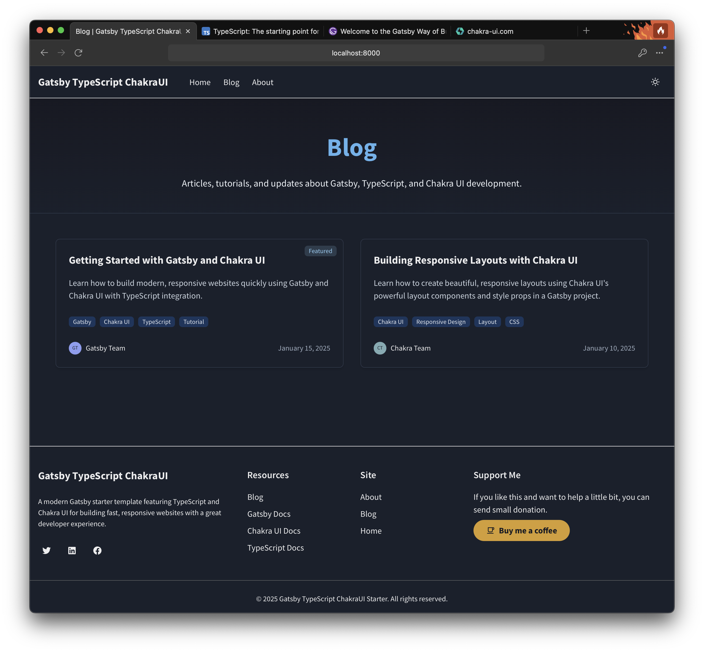

<p align="center">
  <a href="https://www.gatsbyjs.com/">
    
  </a>
  <a href="https://www.typescriptlang.org/">
    
  </a>
  <a href="https://chakra-ui.com/">
    
  </a>
</p>
<h1 align="center">
  Gatsby TypeScript Chakra UI Blog Starter
</h1>

<p align="center">
A modern, opinionated blog starter with Gatsby, TypeScript, and Chakra UI. Features elegant typography, responsive design, and system-aware dark mode.
</p>

## ✨ Features

- **Gatsby** — Fast, optimized websites with great SEO
- **TypeScript** — Type safety and better developer experience
- **Chakra UI** — Beautiful, accessible components with dark mode support
- **Blog-Focused** — Optimized for beautiful article presentation
- **Responsive Design** — Mobile-first design that works on all devices
- **Opinionated Theme** — Clean, elegant typography with Source Sans Pro
- **System-Aware Dark Mode** — Automatically switches based on user preference
- **"Buy Me Coffee" Integration** — Support monetization for your content
- **SEO Optimized** — Meta tags, sitemaps, and robots.txt included

## 🚀 Quick start

1. **Clone the repository**

   ```shell
   git clone https://github.com/cloudy-native/gatsby-typescript-chakraui.git
   ```

2. **Install dependencies**

   ```shell
   cd gatsby-typescript-chakraui
   npm install
   ```

3. **Start the development server**

   ```shell
   npm run develop
   ```

4. **Open the source code and start editing!**

   Your site is now running at `http://localhost:8000`!

   The GraphQL explorer is available at `http://localhost:8000/___graphql`

## 🧐 Project Structure

```
.
├── content/                # Blog content files
│   └── blog/               # Blog posts with Markdown + frontmatter
├── public/                 # Built files (generated after build)
├── src/                    # Source code
│   ├── components/         # React components
│   │   ├── Header.tsx      # Site navigation header
│   │   ├── Footer.tsx      # Site footer with links
│   │   ├── Layout.tsx      # Main layout wrapper
│   │   └── BuyMeCoffeeButton.tsx # Support button
│   ├── pages/              # Page components
│   │   ├── index.tsx       # Homepage
│   │   ├── about.tsx       # About page
│   │   ├── 404.tsx         # 404 page
│   │   └── blog/index.tsx  # Blog listing page
│   ├── templates/          # Page templates for generated pages
│   │   ├── blog-post.tsx   # Full-featured blog post template
│   │   └── blog-post-simple.tsx # Minimal blog post template
│   └── theme/              # Chakra UI theme customization
│       └── index.ts        # Theme configuration
├── gatsby-browser.js       # Browser-specific configurations
├── gatsby-config.ts        # Gatsby configuration
├── gatsby-node.js          # Gatsby Node API implementations
├── gatsby-ssr.js           # Server-side rendering configurations
└── package.json            # Project dependencies and scripts
```

## 🎨 Theme Customization

This starter uses an opinionated theme with:

- **Typography**: Source Sans Pro for both headings and body text
- **Color Mode**: System-aware dark mode that respects user preferences
- **Responsive Design**: Mobile-first approach with adaptive layouts

### Customize the Theme

Edit the theme in `src/theme/index.ts`:

```typescript
// Current theme configuration
const theme = extendTheme({
  config: {
    initialColorMode: "system",
    useSystemColorMode: true,
  },
  fonts: {
    heading: "'Source Sans Pro', sans-serif",
    body: "'Source Sans Pro', sans-serif",
  },
  // Add custom colors, spacing, etc.
});
```

## 📝 Blog Content

Blog posts live in `content/blog/` as Markdown files with frontmatter. Each post should be in its own directory with an `index.md` file and any images used in the post.

Example blog post structure:
```
content/
└── blog/
    └── getting-started-with-gatsby-and-chakra-ui/
        ├── index.md
        └── hero-image.jpg
```

## 🧩 Main Components

- **Layout** - Common layout with header and footer
- **Header** - Navigation with theme toggle and mobile menu
- **Footer** - Site footer with important links
- **BuyMeCoffeeButton** - Support button for reader contributions

## 🚀 Deployment

### Build for production

```shell
npm run build
```

The build output will be in the `public/` directory, ready to be deployed to any static hosting service.

## 🎓 Learning Resources

- **[Gatsby Documentation](https://www.gatsbyjs.com/docs/)**
- **[TypeScript Documentation](https://www.typescriptlang.org/docs/)**
- **[Chakra UI Documentation](https://chakra-ui.com/docs/getting-started)**

## 📝 License

This project is licensed under the MIT License - see the LICENSE file for details. Attribution required.

## 📸 Screenshots

### Home Page (Light Mode)


### Home Page (Dark Mode)


### About Page


### Blog Index


### Blog Post
