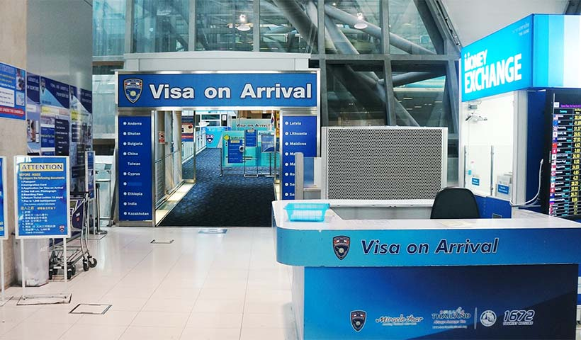

Anyone who's traveled internationally knows the spectrum of visa experiences ranges from "wait, that was it?" to "I might need therapy after this process." After a decade of collecting stamps, stickers, and electronic approvals, I've seen it all – the good, the bad, and the bureaucratically ugly.

*The face of someone discovering they need notarized translations of their great-grandmother's birth certificate*

## The Easy Street Club: Visa-Free and Visa on Arrival

Let's start with the easy wins – countries that essentially roll out the red carpet with minimal fuss:

### Visa on Arrival Champions

*The beautiful sight of a visa on arrival counter*

**Thailand** remains the gold standard of simplicity. Show up, fill out a short form, pay about $30, smile for a photo, and you're in for 30 days of beaches and pad thai. The whole process takes roughly 10 minutes when there's no line.

**Indonesia** (including Bali) follows a similar approach for most nationalities – $35 gets you a 30-day visa that can be extended once while in-country. Pro tip: bring exact change in clean, crisp USD bills to avoid the "sorry, no change" routine.

**Turkey's** e-Visa system deserves special mention for its efficiency – apply online in under five minutes, pay $60, and receive your approval almost instantly. No printing required; just show the digital version on your phone.

## Middle of the Road: Not Painless, Not Painful

These countries require some advance planning but won't leave you questioning your life choices:

**Japan's** tourist visa for most Western countries hits that sweet spot – apply online or through an agency, provide proof of onward travel and accommodation plans, and you'll likely receive approval within a week. The process is organized, predictable, and – shockingly – logical.

**South Korea** follows a similar pattern, with a streamlined K-ETA system for tourists from visa-waiver countries. The online form takes about 15 minutes, costs $10, and typically processes within 24 hours.

**Costa Rica** won't ask for a visa from most visitors, but they will check for proof of onward travel and sufficient funds (about $100 per day of your stay). Fail to show these at check-in, and you'll be frantically booking a refundable flight while holding up the line.

## The Nightmares: Bureaucracy's Final Boss Level

Now for the countries that seem to view visa applications as an Olympic sport in paperwork endurance:

**Russia** has long held the crown for most complex tourist visa process. You'll need an official invitation letter from a Russian hotel or tour company, comprehensive travel insurance, a detailed itinerary of every day of your stay, recent bank statements, and a form that asks everything short of your childhood pet's name. Expect to pay $160-250 depending on processing time, then wait 10-20 business days while contemplating simpler vacation destinations, like perhaps the Moon.

**China** runs a close second, requiring a similar level of documentation plus a personal interview at a consulate for many nationalities. The processing time can stretch to several weeks, and surprise rule changes without notice are not uncommon. I once had my application returned because my passport photos were 35mm × 45mm instead of 33mm × 48mm. Yes, really.

**Brazil** used to be notorious for its visa reciprocity policy, matching whatever process your country required of Brazilian citizens. Americans often faced fees up to $160 and wait times of several weeks. Thankfully, they've significantly simplified their approach recently, but the memory of that bureaucratic tit-for-tat lives on in the nightmares of travel agents.

## Absurdly Expensive vs. Surprisingly Affordable

Speaking of financial pain points...

### Budget-Busters

**Australia's** tourist visa runs about $150, surprisingly steep for a pretty straightforward electronic process.

**The United Kingdom** charges non-EU visitors about £100 ($135) for a standard tourist visa – not exactly a budget-friendly addition to your London trip planning.

But the champion of expensive visas? **Bhutan**, which requires a minimum daily package of $250 in high season ($200 in low season), including a $65 "Sustainable Development Fee" per day. This policy is intentional – they're serious about "high value, low impact" tourism.

### Budget-Friendly Finds

At the other end, **Cambodia's** $30 visa on arrival feels like a bargain for access to Angkor Wat.

**Georgia** offers one of the best deals around – most nationalities can visit visa-free for a full year. Yes, a YEAR. Digital nomads rejoice!

**Malaysia** gives tourists 90 days completely free of charge for most Western passports. Three months of street food heaven without spending a cent on visa fees.

## The Oddball Rules Club

Some countries have visa requirements so specific or strange they deserve special mention:

**Suriname** requires yellow fever vaccination certificates from ALL visitors, regardless of where you're coming from. No certificate, no entry – no exceptions.

**Iran** requires women to wear headscarves in their visa application photos – a preview of the dress code you'll need to follow during your visit.

**Saudi Arabia** used to prohibit solo female travelers under 45, though they've relaxed this rule since launching their tourist visa program in 2019. Progress!

**New Zealand** asks about your intention to "undertake gang activity" on their visa form. I always want to respond, "Well, I hadn't planned on it, but now that you mention it..."

## The Lightning Fast vs. The Glacially Slow

If time is of the essence:

**Singapore's** electronic visa can be approved in as little as 24 hours.

**Mexico's** electronic authorization for eligible countries literally takes minutes.

On the painfully slow end:

**India's** visa processing can stretch to 3+ weeks even when using their "e-Visa" system, which ironically isn't very "e" in terms of efficiency.

**Cuba's** tourist card is simple but can take unpredictable amounts of time – from days to weeks – with little visibility into the process.

## True Stories from the Visa Trenches

My friend Mark once applied for a Senegalese visa and received it back with someone else's photo on it. When he pointed this out, the embassy official shrugged and said, "But the name is correct." He had to argue for a solid 30 minutes to get a new one issued.

Another traveler I met was rejected for an Azerbaijan visa because her passport photo showed her smiling. Apparently, showing teeth is forbidden in their visa photos – a rule mentioned precisely nowhere on their application.

My personal favorite: I once received a Laos visa that listed my nationality as "Monkey" instead of "United States." The official seemed confused about why I wanted it corrected.

## Final Thoughts: The Visa Philosophy

There's a strange inverse relationship between how difficult a country makes their visa process and how desperately tourists want to visit. Russia and China haven't exactly hurting for tourism despite their paperwork gauntlets.

Perhaps the most important visa tip is simply this: start early, follow instructions to the letter (no matter how absurd they seem), and maintain your sense of humor. The stories of visa disasters make the best travel tales once you're safely sipping a cocktail on that beach you fought so hard to reach.

And remember – no matter how bad the process, it's almost always worth it once you arrive. Almost.

*Did I miss any notably easy or difficult visa processes? Share your visa horror stories (or surprising wins) in the comments!*