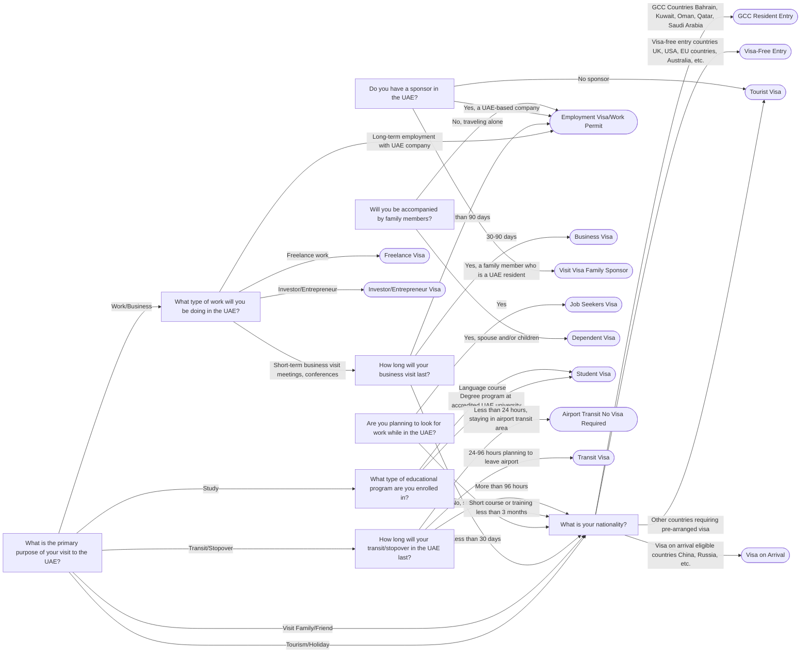

# Visa Decision Tree for United Arab Emirates (ae)

```mermaid
flowchart LR
    q1["What is the primary purpose of your visit to the UAE?"]
    q1 -->|Tourism/Holiday| q2
    q1 -->|Work/Business| q3
    q1 -->|Study| q8
    q1 -->|Visit Family/Friend| q2
    q1 -->|Transit/Stopover| q9
    q2["What is your nationality?"]
    q2 -->|GCC Countries Bahrain, Kuwait, Oman, Qatar, Saudi Arabia| r1
    q2 -->|Visa-free entry countries UK, USA, EU countries, Australia, etc.| r2
    q2 -->|Visa on arrival eligible countries China, Russia, etc.| r3
    q2 -->|Other countries requiring pre-arranged visa| r4
    q3["What type of work will you be doing in the UAE?"]
    q3 -->|Long-term employment with UAE company| r5
    q3 -->|Short-term business visit meetings, conferences| q4
    q3 -->|Freelance work| r7
    q3 -->|Investor/Entrepreneur| r8
    q4["How long will your business visit last?"]
    q4 -->|Less than 30 days| q2
    q4 -->|30-90 days| r9
    q4 -->|More than 90 days| r5
    q5["Do you have a sponsor in the UAE?"]
    q5 -->|Yes, a family member who is a UAE resident| r10
    q5 -->|Yes, a UAE-based company| r5
    q5 -->|No sponsor| r4
    q6["Are you planning to look for work while in the UAE?"]
    q6 -->|Yes| r11
    q6 -->|No, strictly tourism| q2
    q7["Will you be accompanied by family members?"]
    q7 -->|Yes, spouse and/or children| r12
    q7 -->|No, traveling alone| r5
    q8["What type of educational program are you enrolled in?"]
    q8 -->|Degree program at accredited UAE university| r13
    q8 -->|Short course or training less than 3 months| q2
    q8 -->|Language course| r13
    q9["How long will your transit/stopover in the UAE last?"]
    q9 -->|Less than 24 hours, staying in airport transit area| r14
    q9 -->|24-96 hours planning to leave airport| r15
    q9 -->|More than 96 hours| q2
    r1(["GCC Resident Entry"])
    r2(["Visa-Free Entry"])
    r3(["Visa on Arrival"])
    r4(["Tourist Visa"])
    r5(["Employment Visa/Work Permit"])
    r7(["Freelance Visa"])
    r8(["Investor/Entrepreneur Visa"])
    r9(["Business Visa"])
    r10(["Visit Visa Family Sponsor"])
    r11(["Job Seekers Visa"])
    r12(["Dependent Visa"])
    r13(["Student Visa"])
    r14(["Airport Transit No Visa Required"])
    r15(["Transit Visa"])
```
