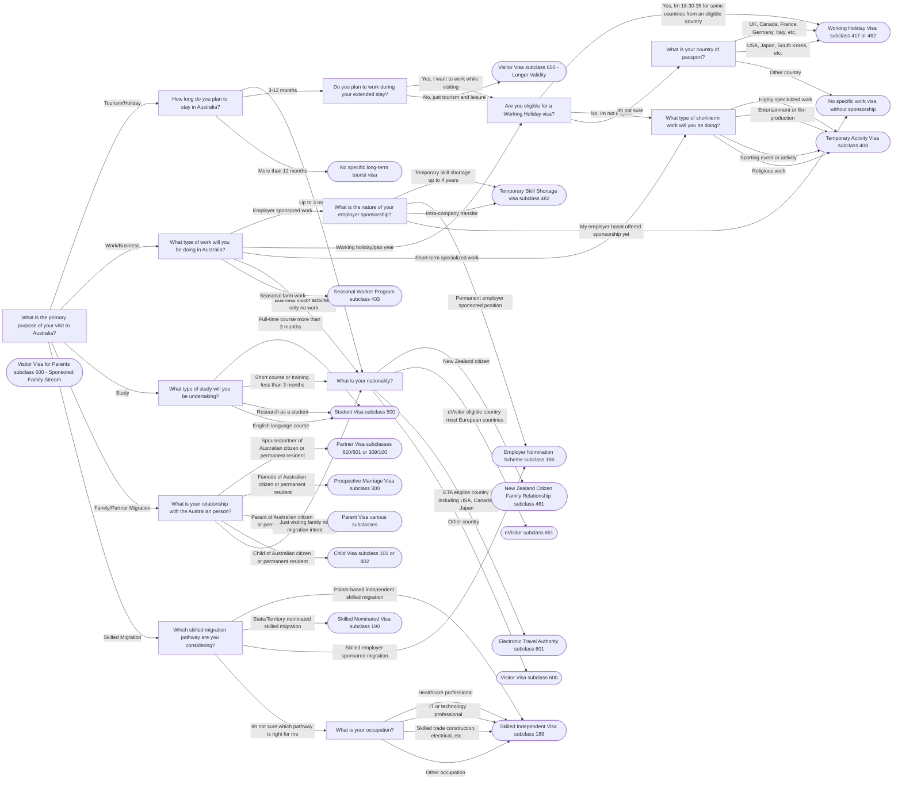

# Visa Decision Tree for australia

```mermaid
flowchart LR
    q1["What is the primary purpose of your visit to Australia?"]
    q1 -->|Tourism/Holiday| q2
    q1 -->|Work/Business| q3
    q1 -->|Study| q4
    q1 -->|Family/Partner Migration| q5
    q1 -->|Skilled Migration| q6
    q2["How long do you plan to stay in Australia?"]
    q2 -->|Up to 3 months| q7
    q2 -->|3-12 months| q8
    q2 -->|More than 12 months| r19
    q3["What type of work will you be doing in Australia?"]
    q3 -->|Employer sponsored work| q9
    q3 -->|Working holiday/gap year| q10
    q3 -->|Short-term specialized work| q11
    q3 -->|Business visitor activities only no work| q7
    q3 -->|Seasonal farm work| r6
    q4["What type of study will you be undertaking?"]
    q4 -->|Full-time course more than 3 months| r7
    q4 -->|Short course or training less than 3 months| q7
    q4 -->|Research as a student| r7
    q4 -->|English language course| r7
    q5["What is your relationship with the Australian person?"]
    q5 -->|Spouse/partner of Australian citizen or permanent resident| r8
    q5 -->|Fiancée of Australian citizen or permanent resident| r9
    q5 -->|Parent of Australian citizen or permanent resident| r10
    q5 -->|Child of Australian citizen or permanent resident| r11
    q5 -->|Just visiting family no migration intent| q7
    q6["Which skilled migration pathway are you considering?"]
    q6 -->|Points-based independent skilled migration| r12
    q6 -->|State/Territory nominated skilled migration| r13
    q6 -->|Skilled employer sponsored migration| r14
    q6 -->|Im not sure which pathway is right for me| q12
    q7["What is your nationality?"]
    q7 -->|New Zealand citizen| r15
    q7 -->|eVisitor eligible country most European countries| r1
    q7 -->|ETA eligible country including USA, Canada, Japan| r2
    q7 -->|Other country| r3
    q8["Do you plan to work during your extended stay?"]
    q8 -->|Yes, I want to work while visiting| q10
    q8 -->|No, just tourism and leisure| r4
    q9["What is the nature of your employer sponsorship?"]
    q9 -->|Temporary skill shortage up to 4 years| r16
    q9 -->|Permanent employer sponsored position| r14
    q9 -->|Intra-company transfer| r16
    q9 -->|My employer hasnt offered sponsorship yet| r17
    q10["Are you eligible for a Working Holiday visa?"]
    q10 -->|Yes, Im 18-30 35 for some countries from an eligible country| r5
    q10 -->|No, Im not eligible| q11
    q10 -->|Im not sure| q13
    q11["What type of short-term work will you be doing?"]
    q11 -->|Highly specialized work| r18
    q11 -->|Entertainment or film production| r18
    q11 -->|Sporting event or activity| r18
    q11 -->|Religious work| r18
    q12["What is your occupation?"]
    q12 -->|Healthcare professional| r12
    q12 -->|IT or technology professional| r12
    q12 -->|Skilled trade construction, electrical, etc.| r12
    q12 -->|Other occupation| r12
    q13["What is your country of passport?"]
    q13 -->|UK, Canada, France, Germany, Italy, etc.| r5
    q13 -->|USA, Japan, South Korea, etc.| r5
    q13 -->|Other country| r17
    r1(["eVisitor subclass 651"])
    r2(["Electronic Travel Authority subclass 601"])
    r3(["Visitor Visa subclass 600"])
    r4(["Visitor Visa subclass 600 - Longer Validity"])
    r5(["Working Holiday Visa subclass 417 or 462"])
    r6(["Seasonal Worker Program subclass 403"])
    r7(["Student Visa subclass 500"])
    r8(["Partner Visa subclasses 820/801 or 309/100"])
    r9(["Prospective Marriage Visa subclass 300"])
    r10(["Parent Visa various subclasses"])
    r11(["Child Visa subclass 101 or 802"])
    r12(["Skilled Independent Visa subclass 189"])
    r13(["Skilled Nominated Visa subclass 190"])
    r14(["Employer Nomination Scheme subclass 186"])
    r15(["New Zealand Citizen Family Relationship subclass 461"])
    r16(["Temporary Skill Shortage visa subclass 482"])
    r17(["No specific work visa without sponsorship"])
    r18(["Temporary Activity Visa subclass 408"])
    r19(["No specific long-term tourist visa"])
    r20(["Visitor Visa for Parents subclass 600 - Sponsored Family Stream"])
```
