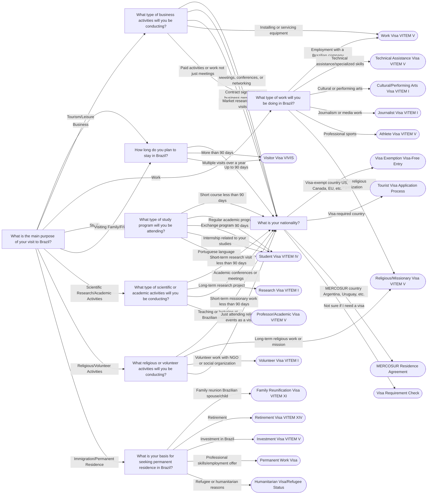

# Visa Decision Tree for Brazil (br)

```mermaid
flowchart LR
    q1["What is the main purpose of your visit to Brazil?"]
    q1 -->|Tourism/Leisure| q2
    q1 -->|Business| q3
    q1 -->|Work| q4
    q1 -->|Study| q5
    q1 -->|Visiting Family/Friends| q2
    q1 -->|Scientific Research/Academic Activities| q6
    q1 -->|Religious/Volunteer Activities| q7
    q1 -->|Immigration/Permanent Residence| q8
    q2["How long do you plan to stay in Brazil?"]
    q2 -->|Up to 90 days| q9
    q2 -->|More than 90 days| r9
    q2 -->|Multiple visits over a year| r9
    q3["What type of business activities will you be conducting?"]
    q3 -->|Meetings, conferences, or networking| q9
    q3 -->|Contract signings or business negotiations| q9
    q3 -->|Market research or site visits| q9
    q3 -->|Installing or servicing equipment| r2
    q3 -->|Paid activities or work not just meetings| q4
    q4["What type of work will you be doing in Brazil?"]
    q4 -->|Employment with a Brazilian company| r2
    q4 -->|Technical assistance/specialized skills| r3
    q4 -->|Cultural or performing arts| r4
    q4 -->|Journalism or media work| r5
    q4 -->|Professional sports| r6
    q4 -->|Work for religious organization| r7
    q5["What type of study program will you be attending?"]
    q5 -->|Short course less than 90 days| q9
    q5 -->|Regular academic program more than 90 days| r8
    q5 -->|Exchange program| r8
    q5 -->|Internship related to your studies| r8
    q5 -->|Portuguese language course| r8
    q6["What type of scientific or academic activities will you be conducting?"]
    q6 -->|Short-term research visit less than 90 days| q9
    q6 -->|Long-term research project| r10
    q6 -->|Academic conferences or meetings| q9
    q6 -->|Teaching or lecturing at Brazilian institution| r11
    q7["What religious or volunteer activities will you be conducting?"]
    q7 -->|Short-term missionary work less than 90 days| q9
    q7 -->|Long-term religious work or mission| r7
    q7 -->|Volunteer work with NGO or social organization| r12
    q7 -->|Just attending religious events as a visitor| q9
    q8["What is your basis for seeking permanent residence in Brazil?"]
    q8 -->|Family reunion Brazilian spouse/child| r13
    q8 -->|Retirement| r14
    q8 -->|Investment in Brazil| r15
    q8 -->|Professional skills/employment offer| r16
    q8 -->|Refugee or humanitarian reasons| r17
    q9["What is your nationality?"]
    q9 -->|Visa-exempt country US, Canada, EU, etc.| r1
    q9 -->|Visa-required country| r18
    q9 -->|MERCOSUR country Argentina, Uruguay, etc.| r19
    q9 -->|Not sure if I need a visa| r20
    r1(["Visa Exemption Visa-Free Entry"])
    r2(["Work Visa VITEM V"])
    r3(["Technical Assistance Visa VITEM V"])
    r4(["Cultural/Performing Arts Visa VITEM I"])
    r5(["Journalist Visa VITEM I"])
    r6(["Athlete Visa VITEM V"])
    r7(["Religious/Missionary Visa VITEM V"])
    r8(["Student Visa VITEM IV"])
    r9(["Visitor Visa VIVIS"])
    r10(["Research Visa VITEM I"])
    r11(["Professor/Academic Visa VITEM V"])
    r12(["Volunteer Visa VITEM I"])
    r13(["Family Reunification Visa VITEM XI"])
    r14(["Retirement Visa VITEM XIV"])
    r15(["Investment Visa VITEM V"])
    r16(["Permanent Work Visa"])
    r17(["Humanitarian Visa/Refugee Status"])
    r18(["Tourist Visa Application Process"])
    r19(["MERCOSUR Residence Agreement"])
    r20(["Visa Requirement Check"])
```
