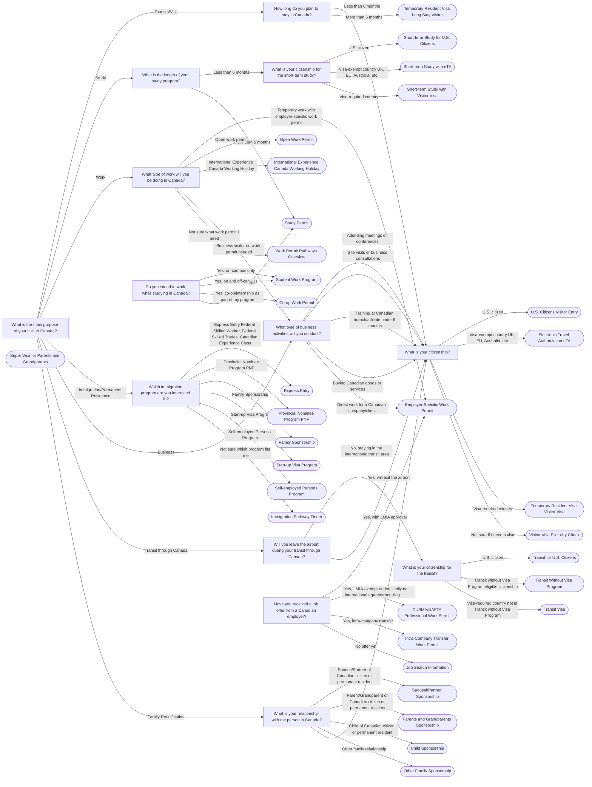

# Visa Decision Tree for canada

```mermaid
flowchart LR
    q1["What is the main purpose of your visit to Canada?"]
    q1 -->|Tourism/Visit| q2
    q1 -->|Study| q3
    q1 -->|Work| q4
    q1 -->|Immigration/Permanent Residence| q5
    q1 -->|Business| q6
    q1 -->|Transit through Canada| q12
    q1 -->|Family Reunification| q7
    q2["How long do you plan to stay in Canada?"]
    q2 -->|Less than 6 months| q8
    q2 -->|More than 6 months| r6
    q3["What is the length of your study program?"]
    q3 -->|Less than 6 months| q9
    q3 -->|More than 6 months| r2
    q4["What type of work will you be doing in Canada?"]
    q4 -->|Temporary work with employer-specific work permit| r3
    q4 -->|Open work permit| r4
    q4 -->|International Experience Canada Working Holiday| r5
    q4 -->|Business visitor no work permit needed| q6
    q4 -->|Not sure what work permit I need| r12
    q5["Which immigration program are you interested in?"]
    q5 -->|Express Entry Federal Skilled Worker, Federal Skilled Trades, Canadian Experience Class| r7
    q5 -->|Provincial Nominee Program PNP| r8
    q5 -->|Family Sponsorship| r9
    q5 -->|Start-up Visa Program| r10
    q5 -->|Self-employed Persons Program| r11
    q5 -->|Not sure which program fits me| r13
    q6["What type of business activities will you conduct?"]
    q6 -->|Attending meetings or conferences| q8
    q6 -->|Site visits or business consultations| q8
    q6 -->|Training at Canadian branch/affiliate under 6 months| q8
    q6 -->|Buying Canadian goods or services| q8
    q6 -->|Direct work for a Canadian company/client| r3
    q7["What is your relationship with the person in Canada?"]
    q7 -->|Spouse/Partner of Canadian citizen or permanent resident| r14
    q7 -->|Parent/Grandparent of Canadian citizen or permanent resident| r15
    q7 -->|Child of Canadian citizen or permanent resident| r16
    q7 -->|Other family relationship| r17
    q7 -->|Just visiting family not immigrating| q8
    q8["What is your citizenship?"]
    q8 -->|U.S. citizen| r18
    q8 -->|Visa-exempt country UK, EU, Australia, etc.| r1
    q8 -->|Visa-required country| r19
    q8 -->|Not sure if I need a visa| r20
    q9["What is your citizenship for the short-term study?"]
    q9 -->|U.S. citizen| r21
    q9 -->|Visa-exempt country UK, EU, Australia, etc.| r22
    q9 -->|Visa-required country| r23
    q10["Do you intend to work while studying in Canada?"]
    q10 -->|Yes, on-campus only| r24
    q10 -->|Yes, on and off-campus| r24
    q10 -->|Yes, co-op/internship as part of my program| r25
    q10 -->|No| r2
    q11["Have you received a job offer from a Canadian employer?"]
    q11 -->|Yes, with LMIA approval| r3
    q11 -->|Yes, LMIA-exempt under international agreements| r26
    q11 -->|Yes, intra-company transfer| r27
    q11 -->|No offer yet| r28
    q12["Will you leave the airport during your transit through Canada?"]
    q12 -->|No, staying in the international transit area| q13
    q12 -->|Yes, will exit the airport| q8
    q13["What is your citizenship for the transit?"]
    q13 -->|U.S. citizen| r29
    q13 -->|Transit without Visa Program eligible citizenship| r30
    q13 -->|Visa-required country not in Transit without Visa Program| r31
    r1(["Electronic Travel Authorization eTA"])
    r2(["Study Permit"])
    r3(["Employer-Specific Work Permit"])
    r4(["Open Work Permit"])
    r5(["International Experience Canada Working Holiday"])
    r6(["Temporary Resident Visa Long Stay Visitor"])
    r7(["Express Entry"])
    r8(["Provincial Nominee Program PNP"])
    r9(["Family Sponsorship"])
    r10(["Start-up Visa Program"])
    r11(["Self-employed Persons Program"])
    r12(["Work Permit Pathways Overview"])
    r13(["Immigration Pathway Finder"])
    r14(["Spousal/Partner Sponsorship"])
    r15(["Parents and Grandparents Sponsorship"])
    r16(["Child Sponsorship"])
    r17(["Other Family Sponsorship"])
    r18(["U.S. Citizens Visitor Entry"])
    r19(["Temporary Resident Visa Visitor Visa"])
    r20(["Visitor Visa Eligibility Check"])
    r21(["Short-term Study for U.S. Citizens"])
    r22(["Short-term Study with eTA"])
    r23(["Short-term Study with Visitor Visa"])
    r24(["Student Work Program"])
    r25(["Co-op Work Permit"])
    r26(["CUSMA/NAFTA Professional Work Permit"])
    r27(["Intra-Company Transfer Work Permit"])
    r28(["Job Search Information"])
    r29(["Transit for U.S. Citizens"])
    r30(["Transit Without Visa Program"])
    r31(["Transit Visa"])
    r32(["Super Visa for Parents and Grandparents"])
```
