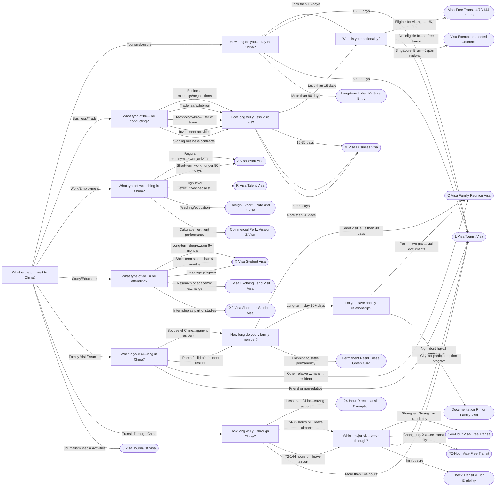

# Visa Decision Tree for china

```mermaid
flowchart LR
    q1["What is the pri...visit to China?"]
    q1 -->|Tourism/Leisure| q2
    q1 -->|Business/Trade| q3
    q1 -->|Work/Employment| q4
    q1 -->|Study/Education| q5
    q1 -->|Family Visit/Reunion| q6
    q1 -->|Transit Through China| q11
    q1 -->|Journalism/Media Activities| r8
    q2["How long do you... stay in China?"]
    q2 -->|Less than 15 days| q7
    q2 -->|15-30 days| r1
    q2 -->|30-90 days| r1
    q2 -->|More than 90 days| r11
    q3["What type of bu... be conducting?"]
    q3 -->|Business meetings/negotiations| q8
    q3 -->|Trade fair/exhibition| q8
    q3 -->|Technology/know...fer or training| q8
    q3 -->|Investment activities| q8
    q3 -->|Signing business contracts| q8
    q4["What type of wo...doing in China?"]
    q4 -->|Regular employm...ny/organization| r3
    q4 -->|Short-term work...under 90 days| r3
    q4 -->|High-level exec...tive/specialist| r4
    q4 -->|Teaching/education| r5
    q4 -->|Cultural/entert...ent performance| r6
    q5["What type of ed...u be attending?"]
    q5 -->|Long-term degre...ram 6+ months| r7
    q5 -->|Short-term stud... than 6 months| r7
    q5 -->|Language program| r7
    q5 -->|Research or academic exchange| r9
    q5 -->|Internship as part of studies| r10
    q6["What is your re...iting in China?"]
    q6 -->|Spouse of Chine...manent resident| q9
    q6 -->|Parent/child of...manent resident| q9
    q6 -->|Other relative ...manent resident| r12
    q6 -->|Friend or non-relative| r1
    q7["What is your nationality?"]
    q7 -->|Eligible for vi...nada, UK, etc.| r13
    q7 -->|Not eligible fo...sa-free transit| r1
    q7 -->|Singapore, Brun... Japan national| r14
    q8["How long will y...ess visit last?"]
    q8 -->|Less than 15 days| q7
    q8 -->|15-30 days| r2
    q8 -->|30-90 days| r2
    q8 -->|More than 90 days| r2
    q9["How long do you... family member?"]
    q9 -->|Short visit le...s than 90 days| r12
    q9 -->|Long-term stay 90+ days| q10
    q9 -->|Planning to settle permanently| r15
    q10["Do you have doc...y relationship?"]
    q10 -->|Yes, I have mar...icial documents| r12
    q10 -->|No, I dont hav...l documentation| r16
    q11["How long will y... through China?"]
    q11 -->|Less than 24 ho...eaving airport| r17
    q11 -->|24-72 hours pl... leave airport| q12
    q11 -->|72-144 hours p... leave airport| q12
    q11 -->|More than 144 hours| r1
    q12["Which major cit... enter through?"]
    q12 -->|Shanghai, Guang...ee transit city| r18
    q12 -->|Chongqing, Xia...ee transit city| r19
    q12 -->|City not partic...emption program| r1
    q12 -->|Im not sure| r20
    r1(["L Visa Tourist Visa"])
    r2(["M Visa Business Visa"])
    r3(["Z Visa Work Visa"])
    r4(["R Visa Talent Visa"])
    r5(["Foreign Expert ...cate and Z Visa"])
    r6(["Commercial Perf...Visa or Z Visa"])
    r7(["X Visa Student Visa"])
    r8(["J Visa Journalist Visa"])
    r9(["F Visa Exchang...and Visit Visa"])
    r10(["X2 Visa Short-...m Student Visa"])
    r11(["Long-term L Vis...Multiple Entry"])
    r12(["Q Visa Family Reunion Visa"])
    r13(["Visa-Free Trans...4/72/144 hours"])
    r14(["Visa Exemption ...ected Countries"])
    r15(["Permanent Resid...nese Green Card"])
    r16(["Documentation R...for Family Visa"])
    r17(["24-Hour Direct ...ansit Exemption"])
    r18(["144-Hour Visa-Free Transit"])
    r19(["72-Hour Visa-Free Transit"])
    r20(["Check Transit V...ion Eligibility"])
```
