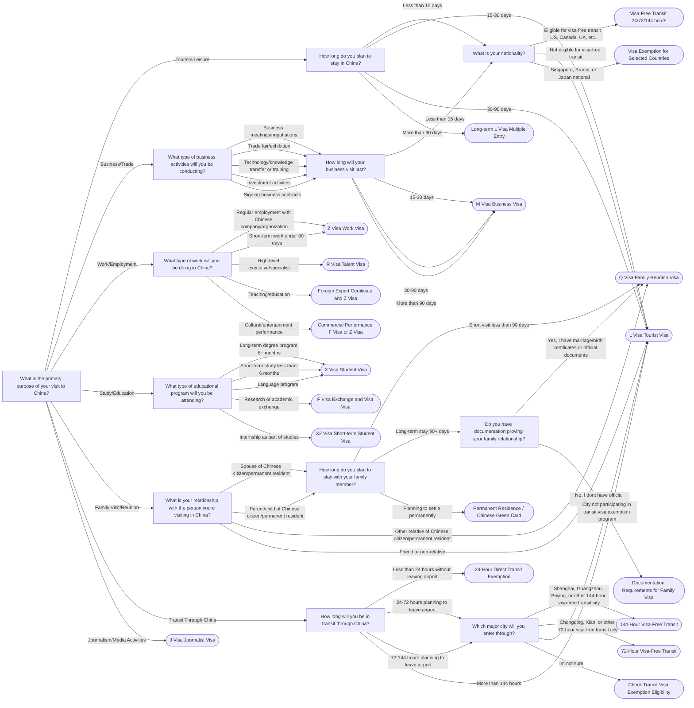

# Visa Decision Tree for China (cn)

```mermaid
flowchart LR
    q1["What is the primary purpose of your visit to China?"]
    q1 -->|Tourism/Leisure| q2
    q1 -->|Business/Trade| q3
    q1 -->|Work/Employment| q4
    q1 -->|Study/Education| q5
    q1 -->|Family Visit/Reunion| q6
    q1 -->|Transit Through China| q11
    q1 -->|Journalism/Media Activities| r8
    q2["How long do you plan to stay in China?"]
    q2 -->|Less than 15 days| q7
    q2 -->|15-30 days| r1
    q2 -->|30-90 days| r1
    q2 -->|More than 90 days| r11
    q3["What type of business activities will you be conducting?"]
    q3 -->|Business meetings/negotiations| q8
    q3 -->|Trade fair/exhibition| q8
    q3 -->|Technology/knowledge transfer or training| q8
    q3 -->|Investment activities| q8
    q3 -->|Signing business contracts| q8
    q4["What type of work will you be doing in China?"]
    q4 -->|Regular employment with Chinese company/organization| r3
    q4 -->|Short-term work under 90 days| r3
    q4 -->|High-level executive/specialist| r4
    q4 -->|Teaching/education| r5
    q4 -->|Cultural/entertainment performance| r6
    q5["What type of educational program will you be attending?"]
    q5 -->|Long-term degree program 6+ months| r7
    q5 -->|Short-term study less than 6 months| r7
    q5 -->|Language program| r7
    q5 -->|Research or academic exchange| r9
    q5 -->|Internship as part of studies| r10
    q6["What is your relationship with the person youre visiting in China?"]
    q6 -->|Spouse of Chinese citizen/permanent resident| q9
    q6 -->|Parent/child of Chinese citizen/permanent resident| q9
    q6 -->|Other relative of Chinese citizen/permanent resident| r12
    q6 -->|Friend or non-relative| r1
    q7["What is your nationality?"]
    q7 -->|Eligible for visa-free transit US, Canada, UK, etc.| r13
    q7 -->|Not eligible for visa-free transit| r1
    q7 -->|Singapore, Brunei, or Japan national| r14
    q8["How long will your business visit last?"]
    q8 -->|Less than 15 days| q7
    q8 -->|15-30 days| r2
    q8 -->|30-90 days| r2
    q8 -->|More than 90 days| r2
    q9["How long do you plan to stay with your family member?"]
    q9 -->|Short visit less than 90 days| r12
    q9 -->|Long-term stay 90+ days| q10
    q9 -->|Planning to settle permanently| r15
    q10["Do you have documentation proving your family relationship?"]
    q10 -->|Yes, I have marriage/birth certificates or official documents| r12
    q10 -->|No, I dont have official documentation| r16
    q11["How long will you be in transit through China?"]
    q11 -->|Less than 24 hours without leaving airport| r17
    q11 -->|24-72 hours planning to leave airport| q12
    q11 -->|72-144 hours planning to leave airport| q12
    q11 -->|More than 144 hours| r1
    q12["Which major city will you enter through?"]
    q12 -->|Shanghai, Guangzhou, Beijing, or other 144-hour visa-free transit city| r18
    q12 -->|Chongqing, Xian, or other 72-hour visa-free transit city| r19
    q12 -->|City not participating in transit visa exemption program| r1
    q12 -->|Im not sure| r20
    r1(["L Visa Tourist Visa"])
    r2(["M Visa Business Visa"])
    r3(["Z Visa Work Visa"])
    r4(["R Visa Talent Visa"])
    r5(["Foreign Expert Certificate and Z Visa"])
    r6(["Commercial Performance F Visa or Z Visa"])
    r7(["X Visa Student Visa"])
    r8(["J Visa Journalist Visa"])
    r9(["F Visa Exchange and Visit Visa"])
    r10(["X2 Visa Short-term Student Visa"])
    r11(["Long-term L Visa Multiple Entry"])
    r12(["Q Visa Family Reunion Visa"])
    r13(["Visa-Free Transit 24/72/144 hours"])
    r14(["Visa Exemption for Selected Countries"])
    r15(["Permanent Residence / Chinese Green Card"])
    r16(["Documentation Requirements for Family Visa"])
    r17(["24-Hour Direct Transit Exemption"])
    r18(["144-Hour Visa-Free Transit"])
    r19(["72-Hour Visa-Free Transit"])
    r20(["Check Transit Visa Exemption Eligibility"])
```
