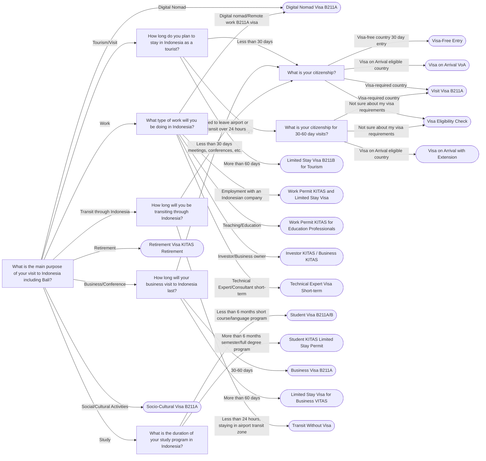

# Visa Decision Tree for Indonesia (including Bali) (id)

```mermaid
flowchart LR
    q1["What is the main purpose of your visit to Indonesia including Bali?"]
    q1 -->|Tourism/Visit| q2
    q1 -->|Work| q3
    q1 -->|Study| q4
    q1 -->|Business/Conference| q5
    q1 -->|Digital Nomad| r6
    q1 -->|Retirement| r7
    q1 -->|Transit through Indonesia| q6
    q1 -->|Social/Cultural Activities| r8
    q2["How long do you plan to stay in Indonesia as a tourist?"]
    q2 -->|Less than 30 days| q7
    q2 -->|30-60 days| q8
    q2 -->|More than 60 days| r5
    q3["What type of work will you be doing in Indonesia?"]
    q3 -->|Employment with an Indonesian company| r9
    q3 -->|Digital nomad/Remote work B211A visa| r6
    q3 -->|Teaching/Education| r10
    q3 -->|Investor/Business owner| r11
    q3 -->|Technical Expert/Consultant short-term| r12
    q4["What is the duration of your study program in Indonesia?"]
    q4 -->|Less than 6 months short course/language program| r13
    q4 -->|More than 6 months semester/full degree program| r14
    q5["How long will your business visit to Indonesia last?"]
    q5 -->|Less than 30 days meetings, conferences, etc.| q7
    q5 -->|30-60 days| r15
    q5 -->|More than 60 days| r16
    q6["How long will you be transiting through Indonesia?"]
    q6 -->|Less than 24 hours, staying in airport transit zone| r17
    q6 -->|Need to leave airport or transit over 24 hours| q7
    q7["What is your citizenship?"]
    q7 -->|Visa-free country 30 day entry| r1
    q7 -->|Visa on Arrival eligible country| r2
    q7 -->|Visa-required country| r3
    q7 -->|Not sure about my visa requirements| r4
    q8["What is your citizenship for 30-60 day visits?"]
    q8 -->|Visa on Arrival eligible country| r18
    q8 -->|Visa-required country| r3
    q8 -->|Not sure about my visa requirements| r4
    r1(["Visa-Free Entry"])
    r2(["Visa on Arrival VoA"])
    r3(["Visit Visa B211A"])
    r4(["Visa Eligibility Check"])
    r5(["Limited Stay Visa B211B for Tourism"])
    r6(["Digital Nomad Visa B211A"])
    r7(["Retirement Visa KITAS Retirement"])
    r8(["Socio-Cultural Visa B211A"])
    r9(["Work Permit KITAS and Limited Stay Visa"])
    r10(["Work Permit KITAS for Education Professionals"])
    r11(["Investor KITAS / Business KITAS"])
    r12(["Technical Expert Visa Short-term"])
    r13(["Student Visa B211A/B"])
    r14(["Student KITAS Limited Stay Permit"])
    r15(["Business Visa B211A"])
    r16(["Limited Stay Visa for Business VITAS"])
    r17(["Transit Without Visa"])
    r18(["Visa on Arrival with Extension"])
```
