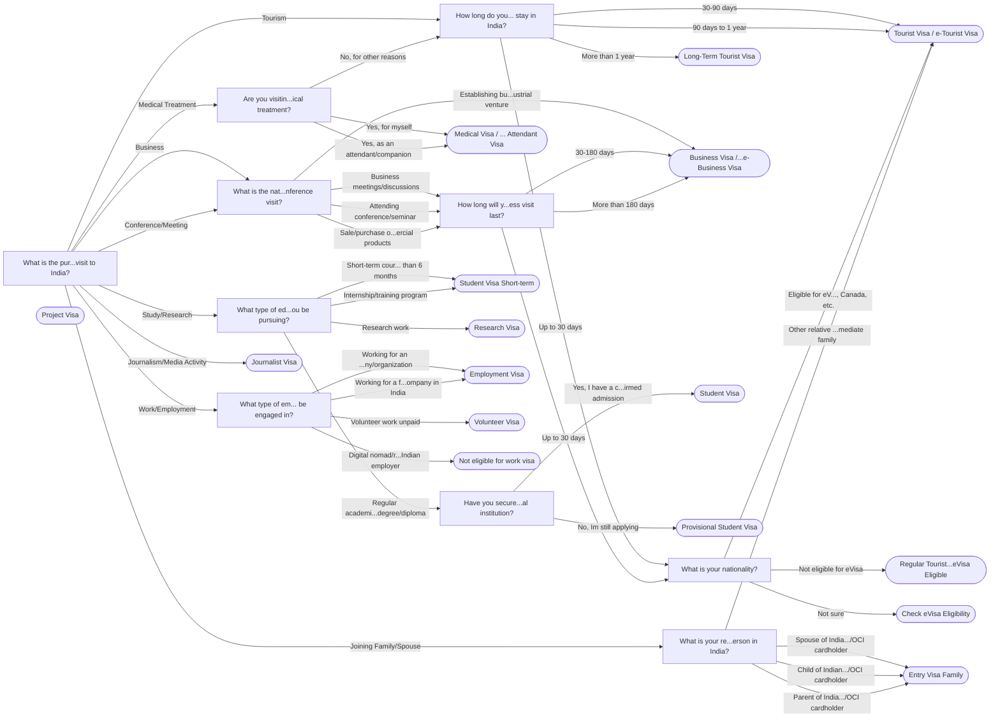

# Visa Decision Tree for india

```mermaid
flowchart LR
    q1["What is the pur...visit to India?"]
    q1 -->|Tourism| q2
    q1 -->|Business| q3
    q1 -->|Medical Treatment| q4
    q1 -->|Study/Research| q5
    q1 -->|Work/Employment| q7
    q1 -->|Joining Family/Spouse| q10
    q1 -->|Conference/Meeting| q3
    q1 -->|Journalism/Media Activity| r8
    q2["How long do you... stay in India?"]
    q2 -->|Up to 30 days| q8
    q2 -->|30-90 days| r1
    q2 -->|90 days to 1 year| r1
    q2 -->|More than 1 year| r3
    q3["What is the nat...nference visit?"]
    q3 -->|Business meetings/discussions| q9
    q3 -->|Attending conference/seminar| q9
    q3 -->|Establishing bu...ustrial venture| r2
    q3 -->|Sale/purchase o...ercial products| q9
    q4["Are you visitin...ical treatment?"]
    q4 -->|Yes, for myself| r4
    q4 -->|Yes, as an attendant/companion| r4
    q4 -->|No, for other reasons| q2
    q5["What type of ed...ou be pursuing?"]
    q5 -->|Regular academi...degree/diploma| q6
    q5 -->|Short-term cour... than 6 months| r6
    q5 -->|Research work| r7
    q5 -->|Internship/training program| r6
    q6["Have you secure...al institution?"]
    q6 -->|Yes, I have a c...irmed admission| r5
    q6 -->|No, Im still applying| r9
    q7["What type of em... be engaged in?"]
    q7 -->|Working for an ...ny/organization| r10
    q7 -->|Working for a f...ompany in India| r10
    q7 -->|Volunteer work unpaid| r12
    q7 -->|Digital nomad/r...Indian employer| r14
    q8["What is your nationality?"]
    q8 -->|Eligible for eV..., Canada, etc.| r1
    q8 -->|Not eligible for eVisa| r15
    q8 -->|Not sure| r16
    q9["How long will y...ess visit last?"]
    q9 -->|Up to 30 days| q8
    q9 -->|30-180 days| r2
    q9 -->|More than 180 days| r2
    q10["What is your re...erson in India?"]
    q10 -->|Spouse of India.../OCI cardholder| r11
    q10 -->|Child of Indian.../OCI cardholder| r11
    q10 -->|Parent of India.../OCI cardholder| r11
    q10 -->|Other relative ...mediate family| r1
    r1(["Tourist Visa / e-Tourist Visa"])
    r2(["Business Visa /...e-Business Visa"])
    r3(["Long-Term Tourist Visa"])
    r4(["Medical Visa / ... Attendant Visa"])
    r5(["Student Visa"])
    r6(["Student Visa Short-term"])
    r7(["Research Visa"])
    r8(["Journalist Visa"])
    r9(["Provisional Student Visa"])
    r10(["Employment Visa"])
    r11(["Entry Visa Family"])
    r12(["Volunteer Visa"])
    r13(["Project Visa"])
    r14(["Not eligible for work visa"])
    r15(["Regular Tourist...eVisa Eligible"])
    r16(["Check eVisa Eligibility"])
```
