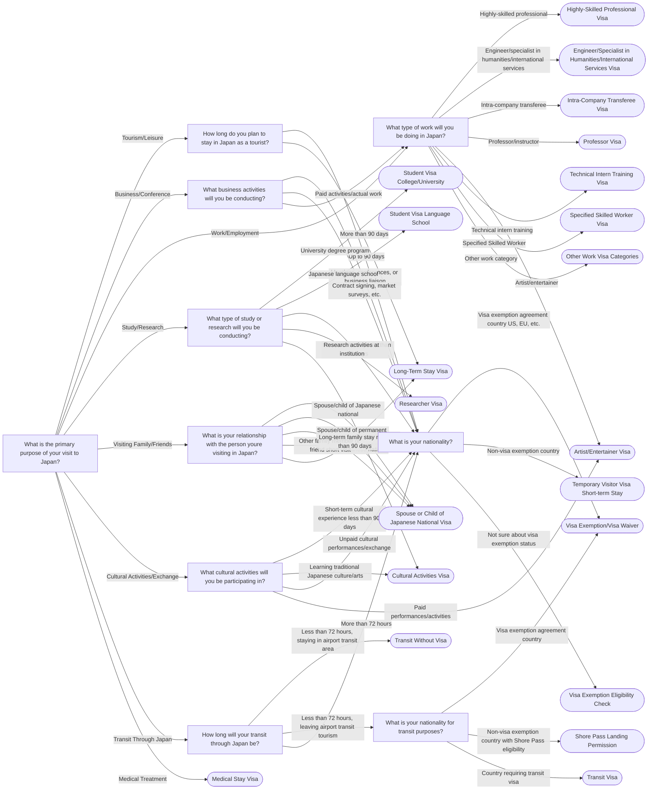

# Visa Decision Tree for japan

```mermaid
flowchart LR
    q1["What is the primary purpose of your visit to Japan?"]
    q1 -->|Tourism/Leisure| q2
    q1 -->|Business/Conference| q3
    q1 -->|Work/Employment| q4
    q1 -->|Study/Research| q5
    q1 -->|Visiting Family/Friends| q6
    q1 -->|Cultural Activities/Exchange| q7
    q1 -->|Transit Through Japan| q8
    q1 -->|Medical Treatment| r15
    q2["How long do you plan to stay in Japan as a tourist?"]
    q2 -->|Up to 90 days| q9
    q2 -->|More than 90 days| r14
    q3["What business activities will you be conducting?"]
    q3 -->|Meetings, conferences, or business liaison| q9
    q3 -->|Contract signing, market surveys, etc.| q9
    q3 -->|Paid activities/actual work| q4
    q4["What type of work will you be doing in Japan?"]
    q4 -->|Highly-skilled professional| r1
    q4 -->|Engineer/specialist in humanities/international services| r2
    q4 -->|Intra-company transferee| r3
    q4 -->|Professor/instructor| r4
    q4 -->|Artist/entertainer| r5
    q4 -->|Technical intern training| r6
    q4 -->|Specified Skilled Worker| r7
    q4 -->|Other work category| r8
    q5["What type of study or research will you be conducting?"]
    q5 -->|University degree program| r9
    q5 -->|Japanese language school| r10
    q5 -->|Short-term study less than 90 days| q9
    q5 -->|Research activities at institution| r11
    q5 -->|Cultural training art, martial arts, etc.| r12
    q6["What is your relationship with the person youre visiting in Japan?"]
    q6 -->|Spouse/child of Japanese national| r13
    q6 -->|Spouse/child of permanent resident| r13
    q6 -->|Parent of Japanese national| r13
    q6 -->|Other family member or friend short visit| q9
    q6 -->|Long-term family stay more than 90 days| r14
    q7["What cultural activities will you be participating in?"]
    q7 -->|Short-term cultural experience less than 90 days| q9
    q7 -->|Learning traditional Japanese culture/arts| r12
    q7 -->|Unpaid cultural performances/exchange| q9
    q7 -->|Paid performances/activities| r5
    q8["How long will your transit through Japan be?"]
    q8 -->|Less than 72 hours, staying in airport transit area| r16
    q8 -->|Less than 72 hours, leaving airport transit tourism| q10
    q8 -->|More than 72 hours| q9
    q9["What is your nationality?"]
    q9 -->|Visa exemption agreement country US, EU, etc.| r17
    q9 -->|Non-visa exemption country| r18
    q9 -->|Not sure about visa exemption status| r19
    q10["What is your nationality for transit purposes?"]
    q10 -->|Visa exemption agreement country| r17
    q10 -->|Non-visa exemption country with Shore Pass eligibility| r20
    q10 -->|Country requiring transit visa| r21
    r1(["Highly-Skilled Professional Visa"])
    r2(["Engineer/Specialist in Humanities/International Services Visa"])
    r3(["Intra-Company Transferee Visa"])
    r4(["Professor Visa"])
    r5(["Artist/Entertainer Visa"])
    r6(["Technical Intern Training Visa"])
    r7(["Specified Skilled Worker Visa"])
    r8(["Other Work Visa Categories"])
    r9(["Student Visa College/University"])
    r10(["Student Visa Language School"])
    r11(["Researcher Visa"])
    r12(["Cultural Activities Visa"])
    r13(["Spouse or Child of Japanese National Visa"])
    r14(["Long-Term Stay Visa"])
    r15(["Medical Stay Visa"])
    r16(["Transit Without Visa"])
    r17(["Visa Exemption/Visa Waiver"])
    r18(["Temporary Visitor Visa Short-term Stay"])
    r19(["Visa Exemption Eligibility Check"])
    r20(["Shore Pass Landing Permission"])
    r21(["Transit Visa"])
```
