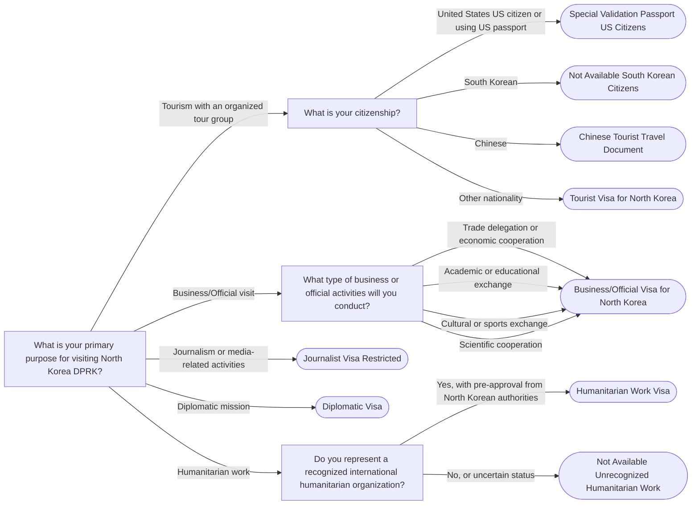

# Visa Decision Tree for North Korea (kp)

```mermaid
flowchart LR
    q1["What is your primary purpose for visiting North Korea DPRK?"]
    q1 -->|Tourism with an organized tour group| q2
    q1 -->|Business/Official visit| q3
    q1 -->|Journalism or media-related activities| r3
    q1 -->|Diplomatic mission| r4
    q1 -->|Humanitarian work| q4
    q2["What is your citizenship?"]
    q2 -->|United States US citizen or using US passport| r5
    q2 -->|South Korean| r6
    q2 -->|Chinese| r7
    q2 -->|Other nationality| r1
    q3["What type of business or official activities will you conduct?"]
    q3 -->|Trade delegation or economic cooperation| r2
    q3 -->|Academic or educational exchange| r2
    q3 -->|Cultural or sports exchange| r2
    q3 -->|Scientific cooperation| r2
    q4["Do you represent a recognized international humanitarian organization?"]
    q4 -->|Yes, with pre-approval from North Korean authorities| r8
    q4 -->|No, or uncertain status| r9
    r1(["Tourist Visa for North Korea"])
    r2(["Business/Official Visa for North Korea"])
    r3(["Journalist Visa Restricted"])
    r4(["Diplomatic Visa"])
    r5(["Special Validation Passport US Citizens"])
    r6(["Not Available South Korean Citizens"])
    r7(["Chinese Tourist Travel Document"])
    r8(["Humanitarian Work Visa"])
    r9(["Not Available Unrecognized Humanitarian Work"])
```
