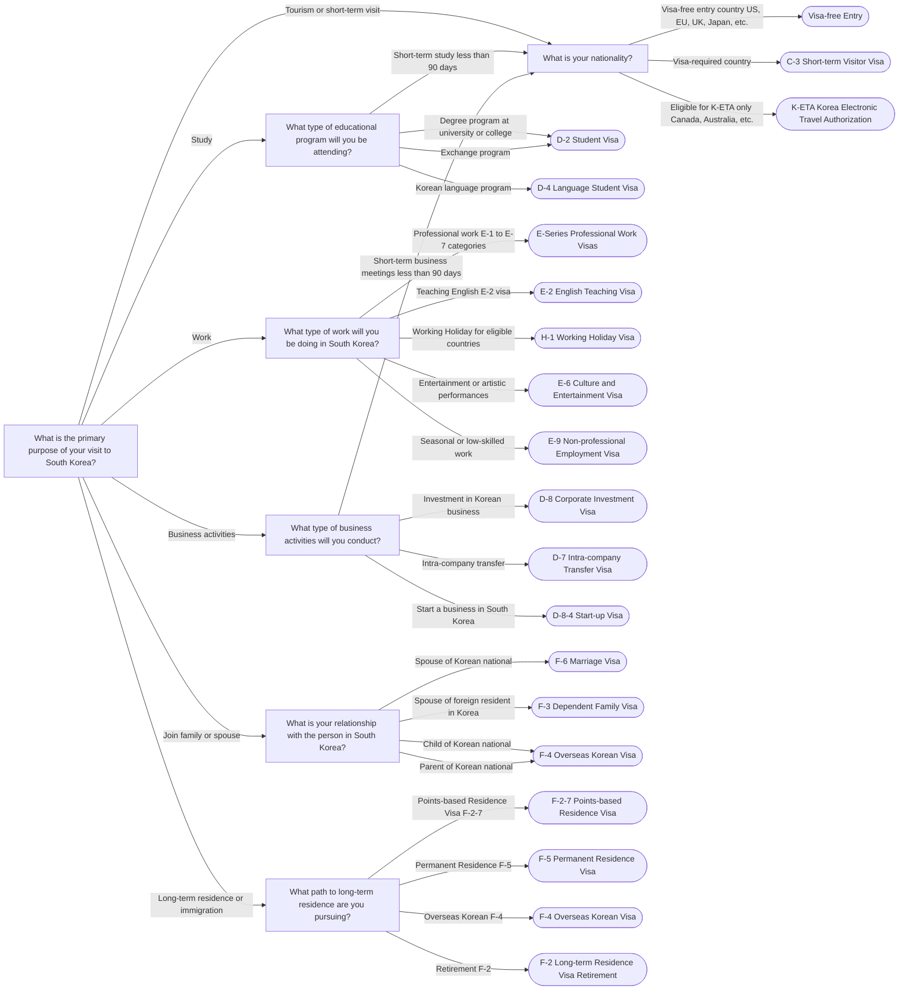

# Visa Decision Tree for South Korea (kr)

```mermaid
flowchart LR
    q1["What is the primary purpose of your visit to South Korea?"]
    q1 -->|Tourism or short-term visit| q2
    q1 -->|Study| q3
    q1 -->|Work| q4
    q1 -->|Business activities| q5
    q1 -->|Join family or spouse| q6
    q1 -->|Long-term residence or immigration| q7
    q2["What is your nationality?"]
    q2 -->|Visa-free entry country US, EU, UK, Japan, etc.| r1
    q2 -->|Visa-required country| r2
    q2 -->|Eligible for K-ETA only Canada, Australia, etc.| r3
    q3["What type of educational program will you be attending?"]
    q3 -->|Degree program at university or college| r4
    q3 -->|Korean language program| r5
    q3 -->|Short-term study less than 90 days| q2
    q3 -->|Exchange program| r4
    q4["What type of work will you be doing in South Korea?"]
    q4 -->|Professional work E-1 to E-7 categories| r6
    q4 -->|Teaching English E-2 visa| r7
    q4 -->|Working Holiday for eligible countries| r8
    q4 -->|Entertainment or artistic performances| r9
    q4 -->|Seasonal or low-skilled work| r10
    q5["What type of business activities will you conduct?"]
    q5 -->|Short-term business meetings less than 90 days| q2
    q5 -->|Investment in Korean business| r11
    q5 -->|Intra-company transfer| r12
    q5 -->|Start a business in South Korea| r13
    q6["What is your relationship with the person in South Korea?"]
    q6 -->|Spouse of Korean national| r14
    q6 -->|Spouse of foreign resident in Korea| r15
    q6 -->|Child of Korean national| r16
    q6 -->|Parent of Korean national| r16
    q7["What path to long-term residence are you pursuing?"]
    q7 -->|Points-based Residence Visa F-2-7| r17
    q7 -->|Permanent Residence F-5| r18
    q7 -->|Overseas Korean F-4| r19
    q7 -->|Retirement F-2| r20
    r1(["Visa-free Entry"])
    r2(["C-3 Short-term Visitor Visa"])
    r3(["K-ETA Korea Electronic Travel Authorization"])
    r4(["D-2 Student Visa"])
    r5(["D-4 Language Student Visa"])
    r6(["E-Series Professional Work Visas"])
    r7(["E-2 English Teaching Visa"])
    r8(["H-1 Working Holiday Visa"])
    r9(["E-6 Culture and Entertainment Visa"])
    r10(["E-9 Non-professional Employment Visa"])
    r11(["D-8 Corporate Investment Visa"])
    r12(["D-7 Intra-company Transfer Visa"])
    r13(["D-8-4 Start-up Visa"])
    r14(["F-6 Marriage Visa"])
    r15(["F-3 Dependent Family Visa"])
    r16(["F-4 Overseas Korean Visa"])
    r17(["F-2-7 Points-based Residence Visa"])
    r18(["F-5 Permanent Residence Visa"])
    r19(["F-4 Overseas Korean Visa"])
    r20(["F-2 Long-term Residence Visa Retirement"])
```
