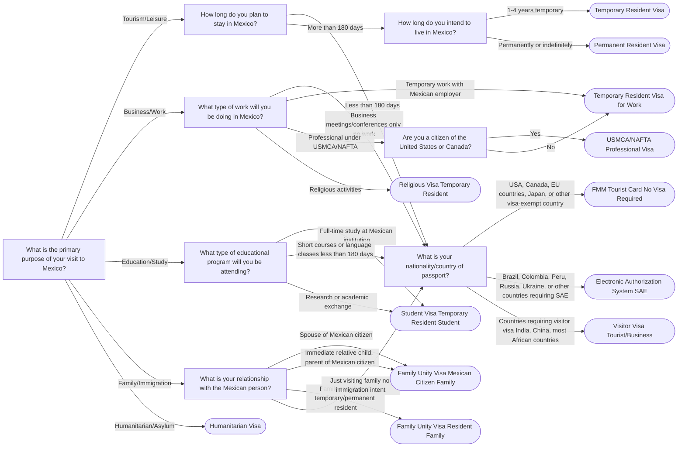

# Visa Decision Tree for Mexico (mx)

```mermaid
flowchart LR
    q1["What is the primary purpose of your visit to Mexico?"]
    q1 -->|Tourism/Leisure| q2
    q1 -->|Business/Work| q3
    q1 -->|Education/Study| q4
    q1 -->|Family/Immigration| q5
    q1 -->|Humanitarian/Asylum| r9
    q2["How long do you plan to stay in Mexico?"]
    q2 -->|Less than 180 days| q6
    q2 -->|More than 180 days| q7
    q3["What type of work will you be doing in Mexico?"]
    q3 -->|Business meetings/conferences only no work| q6
    q3 -->|Temporary work with Mexican employer| r3
    q3 -->|Professional under USMCA/NAFTA| q8
    q3 -->|Religious activities| r6
    q4["What type of educational program will you be attending?"]
    q4 -->|Full-time study at Mexican institution| r5
    q4 -->|Short courses or language classes less than 180 days| q6
    q4 -->|Research or academic exchange| r5
    q5["What is your relationship with the Mexican person?"]
    q5 -->|Spouse of Mexican citizen| r7
    q5 -->|Immediate relative child, parent of Mexican citizen| r7
    q5 -->|Family member of temporary/permanent resident| r8
    q5 -->|Just visiting family no immigration intent| q6
    q6["What is your nationality/country of passport?"]
    q6 -->|USA, Canada, EU countries, Japan, or other visa-exempt country| r1
    q6 -->|Brazil, Colombia, Peru, Russia, Ukraine, or other countries requiring SAE| r2
    q6 -->|Countries requiring visitor visa India, China, most African countries| r10
    q7["How long do you intend to live in Mexico?"]
    q7 -->|1-4 years temporary| r4
    q7 -->|Permanently or indefinitely| r11
    q8["Are you a citizen of the United States or Canada?"]
    q8 -->|Yes| r12
    q8 -->|No| r3
    r1(["FMM Tourist Card No Visa Required"])
    r2(["Electronic Authorization System SAE"])
    r3(["Temporary Resident Visa for Work"])
    r4(["Temporary Resident Visa"])
    r5(["Student Visa Temporary Resident Student"])
    r6(["Religious Visa Temporary Resident"])
    r7(["Family Unity Visa Mexican Citizen Family"])
    r8(["Family Unity Visa Resident Family"])
    r9(["Humanitarian Visa"])
    r10(["Visitor Visa Tourist/Business"])
    r11(["Permanent Resident Visa"])
    r12(["USMCA/NAFTA Professional Visa"])
```
