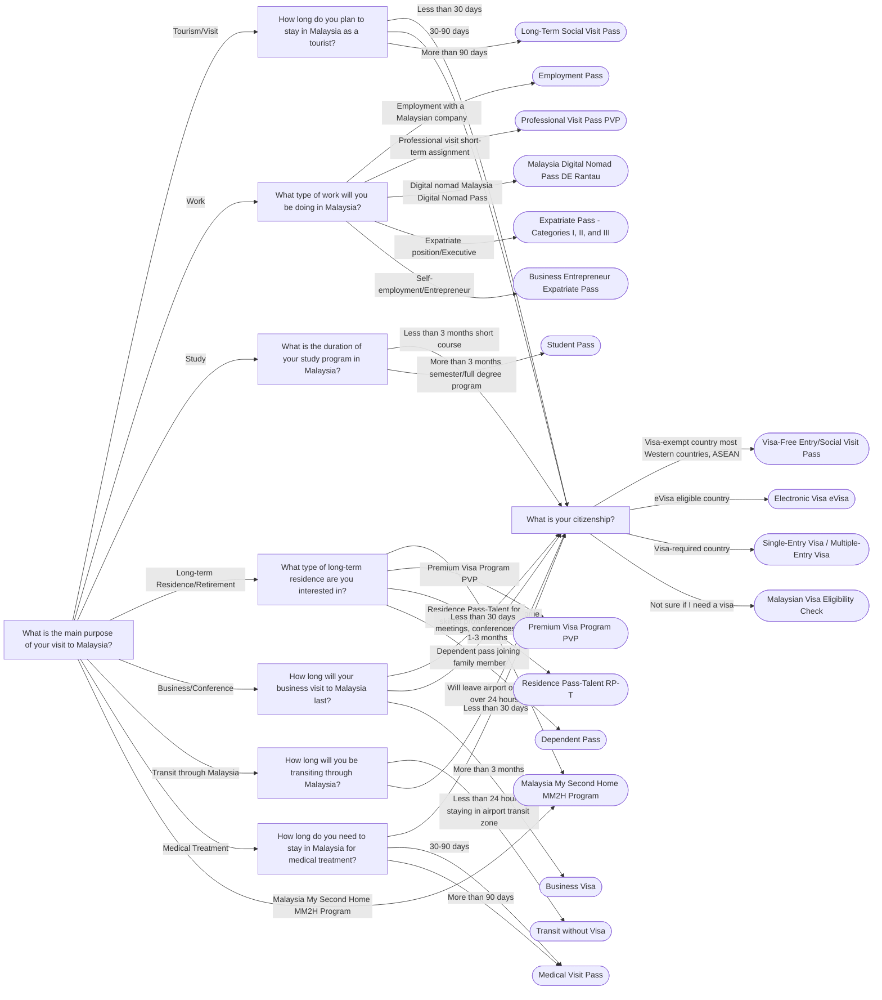

# Visa Decision Tree for Malaysia (my)

```mermaid
flowchart LR
    q1["What is the main purpose of your visit to Malaysia?"]
    q1 -->|Tourism/Visit| q2
    q1 -->|Work| q3
    q1 -->|Study| q4
    q1 -->|Long-term Residence/Retirement| q5
    q1 -->|Business/Conference| q6
    q1 -->|Transit through Malaysia| q7
    q1 -->|Medical Treatment| q8
    q1 -->|Malaysia My Second Home MM2H Program| r17
    q2["How long do you plan to stay in Malaysia as a tourist?"]
    q2 -->|Less than 30 days| q9
    q2 -->|30-90 days| q9
    q2 -->|More than 90 days| r2
    q3["What type of work will you be doing in Malaysia?"]
    q3 -->|Employment with a Malaysian company| r3
    q3 -->|Professional visit short-term assignment| r4
    q3 -->|Digital nomad Malaysia Digital Nomad Pass| r5
    q3 -->|Expatriate position/Executive| r6
    q3 -->|Self-employment/Entrepreneur| r7
    q4["What is the duration of your study program in Malaysia?"]
    q4 -->|Less than 3 months short course| q9
    q4 -->|More than 3 months semester/full degree program| r8
    q5["What type of long-term residence are you interested in?"]
    q5 -->|Malaysia My Second Home MM2H Program| r17
    q5 -->|Premium Visa Program PVP| r9
    q5 -->|Residence Pass-Talent for skilled professionals| r10
    q5 -->|Dependent pass joining family member| r11
    q6["How long will your business visit to Malaysia last?"]
    q6 -->|Less than 30 days meetings, conferences, etc.| q9
    q6 -->|1-3 months| q9
    q6 -->|More than 3 months| r12
    q7["How long will you be transiting through Malaysia?"]
    q7 -->|Less than 24 hours, staying in airport transit zone| r13
    q7 -->|Will leave airport or transit over 24 hours| q9
    q8["How long do you need to stay in Malaysia for medical treatment?"]
    q8 -->|Less than 30 days| q9
    q8 -->|30-90 days| r14
    q8 -->|More than 90 days| r14
    q9["What is your citizenship?"]
    q9 -->|Visa-exempt country most Western countries, ASEAN| r1
    q9 -->|eVisa eligible country| r15
    q9 -->|Visa-required country| r16
    q9 -->|Not sure if I need a visa| r18
    r1(["Visa-Free Entry/Social Visit Pass"])
    r2(["Long-Term Social Visit Pass"])
    r3(["Employment Pass"])
    r4(["Professional Visit Pass PVP"])
    r5(["Malaysia Digital Nomad Pass DE Rantau"])
    r6(["Expatriate Pass - Categories I, II, and III"])
    r7(["Business Entrepreneur Expatriate Pass"])
    r8(["Student Pass"])
    r9(["Premium Visa Program PVP"])
    r10(["Residence Pass-Talent RP-T"])
    r11(["Dependent Pass"])
    r12(["Business Visa"])
    r13(["Transit without Visa"])
    r14(["Medical Visit Pass"])
    r15(["Electronic Visa eVisa"])
    r16(["Single-Entry Visa / Multiple-Entry Visa"])
    r17(["Malaysia My Second Home MM2H Program"])
    r18(["Malaysian Visa Eligibility Check"])
```
