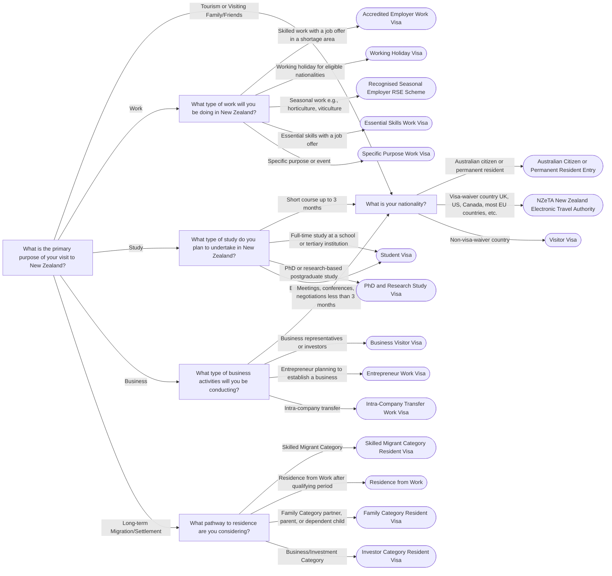

# Visa Decision Tree for New Zealand (nz)

```mermaid
flowchart LR
    q1["What is the primary purpose of your visit to New Zealand?"]
    q1 -->|Tourism or Visiting Family/Friends| q2
    q1 -->|Work| q3
    q1 -->|Study| q4
    q1 -->|Business| q5
    q1 -->|Long-term Migration/Settlement| q6
    q2["What is your nationality?"]
    q2 -->|Australian citizen or permanent resident| r1
    q2 -->|Visa-waiver country UK, US, Canada, most EU countries, etc.| r2
    q2 -->|Non-visa-waiver country| r3
    q3["What type of work will you be doing in New Zealand?"]
    q3 -->|Skilled work with a job offer in a shortage area| r4
    q3 -->|Working holiday for eligible nationalities| r5
    q3 -->|Seasonal work e.g., horticulture, viticulture| r6
    q3 -->|Essential skills with a job offer| r7
    q3 -->|Specific purpose or event| r8
    q4["What type of study do you plan to undertake in New Zealand?"]
    q4 -->|Short course up to 3 months| q2
    q4 -->|Full-time study at a school or tertiary institution| r9
    q4 -->|PhD or research-based postgraduate study| r10
    q4 -->|English language course| r9
    q5["What type of business activities will you be conducting?"]
    q5 -->|Meetings, conferences, negotiations less than 3 months| q2
    q5 -->|Business representatives or investors| r11
    q5 -->|Entrepreneur planning to establish a business| r12
    q5 -->|Intra-company transfer| r13
    q6["What pathway to residence are you considering?"]
    q6 -->|Skilled Migrant Category| r14
    q6 -->|Residence from Work after qualifying period| r15
    q6 -->|Family Category partner, parent, or dependent child| r16
    q6 -->|Business/Investment Category| r17
    r1(["Australian Citizen or Permanent Resident Entry"])
    r2(["NZeTA New Zealand Electronic Travel Authority"])
    r3(["Visitor Visa"])
    r4(["Accredited Employer Work Visa"])
    r5(["Working Holiday Visa"])
    r6(["Recognised Seasonal Employer RSE Scheme"])
    r7(["Essential Skills Work Visa"])
    r8(["Specific Purpose Work Visa"])
    r9(["Student Visa"])
    r10(["PhD and Research Study Visa"])
    r11(["Business Visitor Visa"])
    r12(["Entrepreneur Work Visa"])
    r13(["Intra-Company Transfer Work Visa"])
    r14(["Skilled Migrant Category Resident Visa"])
    r15(["Residence from Work"])
    r16(["Family Category Resident Visa"])
    r17(["Investor Category Resident Visa"])
```
