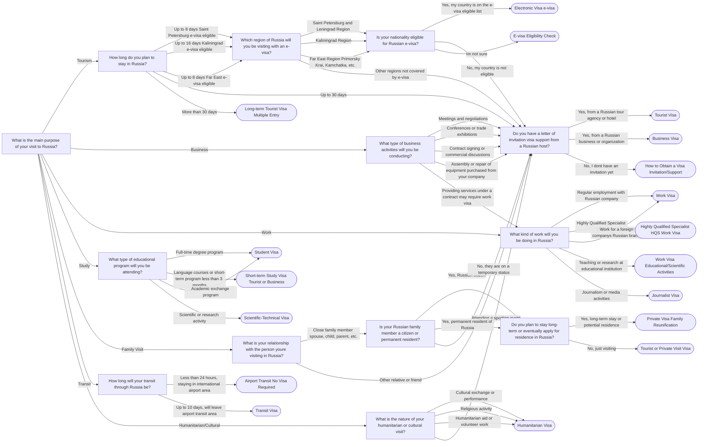

# Visa Decision Tree for Russia (ru)

```mermaid
flowchart LR
    q1["What is the main purpose of your visit to Russia?"]
    q1 -->|Tourism| q2
    q1 -->|Business| q3
    q1 -->|Work| q4
    q1 -->|Study| q5
    q1 -->|Family Visit| q6
    q1 -->|Transit| q13
    q1 -->|Humanitarian/Cultural| q7
    q2["How long do you plan to stay in Russia?"]
    q2 -->|Up to 8 days Saint Petersburg e-visa eligible| q9
    q2 -->|Up to 16 days Kaliningrad e-visa eligible| q9
    q2 -->|Up to 8 days Far East e-visa eligible| q9
    q2 -->|Up to 30 days| q8
    q2 -->|More than 30 days| r9
    q3["What type of business activities will you be conducting?"]
    q3 -->|Meetings and negotiations| q8
    q3 -->|Conferences or trade exhibitions| q8
    q3 -->|Contract signing or commercial discussions| q8
    q3 -->|Assembly or repair of equipment purchased from your company| q8
    q3 -->|Providing services under a contract may require work visa| q4
    q4["What kind of work will you be doing in Russia?"]
    q4 -->|Regular employment with Russian company| r2
    q4 -->|Highly Qualified Specialist HQS| r3
    q4 -->|Work for a foreign companys Russian branch| r2
    q4 -->|Teaching or research at educational institution| r4
    q4 -->|Journalism or media activities| r5
    q5["What type of educational program will you be attending?"]
    q5 -->|Full-time degree program| r6
    q5 -->|Language courses or short-term program less than 3 months| r7
    q5 -->|Academic exchange program| r6
    q5 -->|Scientific or research activity| r8
    q6["What is your relationship with the person youre visiting in Russia?"]
    q6 -->|Close family member spouse, child, parent, etc.| q11
    q6 -->|Other relative or friend| q8
    q7["What is the nature of your humanitarian or cultural visit?"]
    q7 -->|Cultural exchange or performance| r10
    q7 -->|Religious activity| r10
    q7 -->|Humanitarian aid or volunteer work| r10
    q7 -->|Attending a sporting event| q8
    q8["Do you have a letter of invitation visa support from a Russian host?"]
    q8 -->|Yes, from a Russian tour agency or hotel| r1
    q8 -->|Yes, from a Russian business or organization| r11
    q8 -->|No, I dont have an invitation yet| r12
    q9["Which region of Russia will you be visiting with an e-visa?"]
    q9 -->|Saint Petersburg and Leningrad Region| q10
    q9 -->|Kaliningrad Region| q10
    q9 -->|Far East Region Primorsky Krai, Kamchatka, etc.| q10
    q9 -->|Other regions not covered by e-visa| q8
    q10["Is your nationality eligible for Russian e-visa?"]
    q10 -->|Yes, my country is on the e-visa eligible list| r13
    q10 -->|No, my country is not eligible| q8
    q10 -->|Im not sure| r14
    q11["Is your Russian family member a citizen or permanent resident?"]
    q11 -->|Yes, Russian citizen| q12
    q11 -->|Yes, permanent resident of Russia| q12
    q11 -->|No, they are on a temporary status| q8
    q12["Do you plan to stay long-term or eventually apply for residence in Russia?"]
    q12 -->|Yes, long-term stay or potential residence| r15
    q12 -->|No, just visiting| r16
    q13["How long will your transit through Russia be?"]
    q13 -->|Less than 24 hours, staying in international airport area| r17
    q13 -->|Up to 10 days, will leave airport transit area| r18
    r1(["Tourist Visa"])
    r2(["Work Visa"])
    r3(["Highly Qualified Specialist HQS Work Visa"])
    r4(["Work Visa Educational/Scientific Activities"])
    r5(["Journalist Visa"])
    r6(["Student Visa"])
    r7(["Short-term Study Visa Tourist or Business"])
    r8(["Scientific-Technical Visa"])
    r9(["Long-term Tourist Visa Multiple Entry"])
    r10(["Humanitarian Visa"])
    r11(["Business Visa"])
    r12(["How to Obtain a Visa Invitation/Support"])
    r13(["Electronic Visa e-visa"])
    r14(["E-visa Eligibility Check"])
    r15(["Private Visa Family Reunification"])
    r16(["Tourist or Private Visit Visa"])
    r17(["Airport Transit No Visa Required"])
    r18(["Transit Visa"])
```
