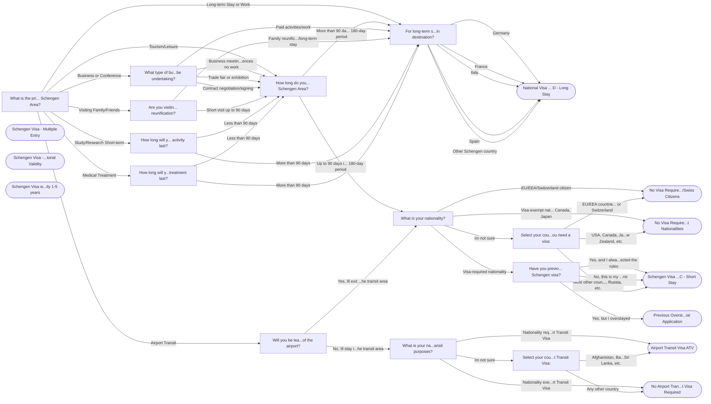

# Visa Decision Tree for schengen

```mermaid
flowchart LR
    q1["What is the pri... Schengen Area?"]
    q1 -->|Tourism/Leisure| q2
    q1 -->|Business or Conference| q3
    q1 -->|Visiting Family/Friends| q4
    q1 -->|Study/Research Short-term| q5
    q1 -->|Medical Treatment| q6
    q1 -->|Long-term Stay or Work| q7
    q1 -->|Airport Transit| q8
    q2["How long do you... Schengen Area?"]
    q2 -->|Up to 90 days i... 180-day period| q9
    q2 -->|More than 90 da... 180-day period| q7
    q3["What type of bu...be undertaking?"]
    q3 -->|Business meetin...ences no work| q2
    q3 -->|Paid activities/work| q7
    q3 -->|Trade fair or exhibition| q2
    q3 -->|Contract negotiation/signing| q2
    q4["Are you visitin... reunification?"]
    q4 -->|Short visit up to 90 days| q2
    q4 -->|Family reunific.../long-term stay| q7
    q5["How long will y... activity last?"]
    q5 -->|Less than 90 days| q2
    q5 -->|More than 90 days| q7
    q6["How long will y...treatment last?"]
    q6 -->|Less than 90 days| q2
    q6 -->|More than 90 days| q7
    q7["For long-term s...in destination?"]
    q7 -->|Germany| r10
    q7 -->|France| r10
    q7 -->|Italy| r10
    q7 -->|Spain| r10
    q7 -->|Other Schengen country| r10
    q8["Will you be lea...of the airport?"]
    q8 -->|Yes, Ill exit ...he transit area| q9
    q8 -->|No, Ill stay i...he transit area| q10
    q9["What is your nationality?"]
    q9 -->|EU/EEA/Switzerland citizen| r1
    q9 -->|Visa-exempt nat... Canada, Japan| r2
    q9 -->|Visa-required nationality| q11
    q9 -->|Im not sure| q12
    q10["What is your na...ansit purposes?"]
    q10 -->|Nationality req...rt Transit Visa| r9
    q10 -->|Nationality exe...rt Transit Visa| r8
    q10 -->|Im not sure| q13
    q11["Have you previo... Schengen visa?"]
    q11 -->|Yes, and I alwa...ected the rules| r3
    q11 -->|Yes, but I overstayed| r7
    q11 -->|No, this is my ...rst application| r3
    q12["Select your cou...ou need a visa:"]
    q12 -->|EU/EEA countrie... or Switzerland| r1
    q12 -->|USA, Canada, Ja...w Zealand, etc.| r2
    q12 -->|Most other coun..., Russia, etc.| r3
    q13["Select your cou...t Transit Visa:"]
    q13 -->|Afghanistan, Ba...Sri Lanka, etc.| r9
    q13 -->|Any other country| r8
    r1(["No Visa Require.../Swiss Citizens"])
    r2(["No Visa Require...t Nationalities"])
    r3(["Schengen Visa ...C - Short Stay"])
    r4(["Schengen Visa - Multiple Entry"])
    r5(["Schengen Visa -...torial Validity"])
    r6(["Schengen Visa w...ity 1-5 years"])
    r7(["Previous Overst...ial Application"])
    r8(["No Airport Tran...t Visa Required"])
    r9(["Airport Transit Visa ATV"])
    r10(["National Visa ... D - Long Stay"])
```
