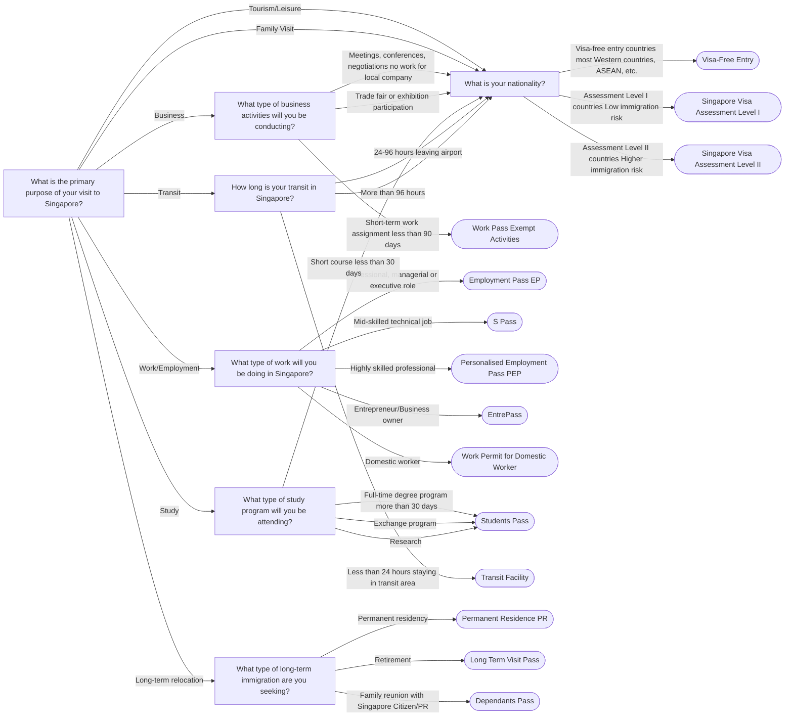

# Visa Decision Tree for Singapore (sg)

```mermaid
flowchart LR
    q1["What is the primary purpose of your visit to Singapore?"]
    q1 -->|Tourism/Leisure| q2
    q1 -->|Business| q3
    q1 -->|Work/Employment| q4
    q1 -->|Study| q5
    q1 -->|Family Visit| q2
    q1 -->|Transit| q6
    q1 -->|Long-term relocation| q7
    q2["What is your nationality?"]
    q2 -->|Visa-free entry countries most Western countries, ASEAN, etc.| r1
    q2 -->|Assessment Level I countries Low immigration risk| r2
    q2 -->|Assessment Level II countries Higher immigration risk| r3
    q3["What type of business activities will you be conducting?"]
    q3 -->|Meetings, conferences, negotiations no work for local company| q2
    q3 -->|Short-term work assignment less than 90 days| r4
    q3 -->|Trade fair or exhibition participation| q2
    q4["What type of work will you be doing in Singapore?"]
    q4 -->|Professional, managerial or executive role| r5
    q4 -->|Mid-skilled technical job| r6
    q4 -->|Highly skilled professional| r7
    q4 -->|Entrepreneur/Business owner| r8
    q4 -->|Domestic worker| r9
    q5["What type of study program will you be attending?"]
    q5 -->|Full-time degree program more than 30 days| r10
    q5 -->|Short course less than 30 days| q2
    q5 -->|Exchange program| r10
    q5 -->|Research| r10
    q6["How long is your transit in Singapore?"]
    q6 -->|Less than 24 hours staying in transit area| r11
    q6 -->|24-96 hours leaving airport| q2
    q6 -->|More than 96 hours| q2
    q7["What type of long-term immigration are you seeking?"]
    q7 -->|Permanent residency| r12
    q7 -->|Retirement| r13
    q7 -->|Family reunion with Singapore Citizen/PR| r14
    r1(["Visa-Free Entry"])
    r2(["Singapore Visa Assessment Level I"])
    r3(["Singapore Visa Assessment Level II"])
    r4(["Work Pass Exempt Activities"])
    r5(["Employment Pass EP"])
    r6(["S Pass"])
    r7(["Personalised Employment Pass PEP"])
    r8(["EntrePass"])
    r9(["Work Permit for Domestic Worker"])
    r10(["Students Pass"])
    r11(["Transit Facility"])
    r12(["Permanent Residence PR"])
    r13(["Long Term Visit Pass"])
    r14(["Dependants Pass"])
```
