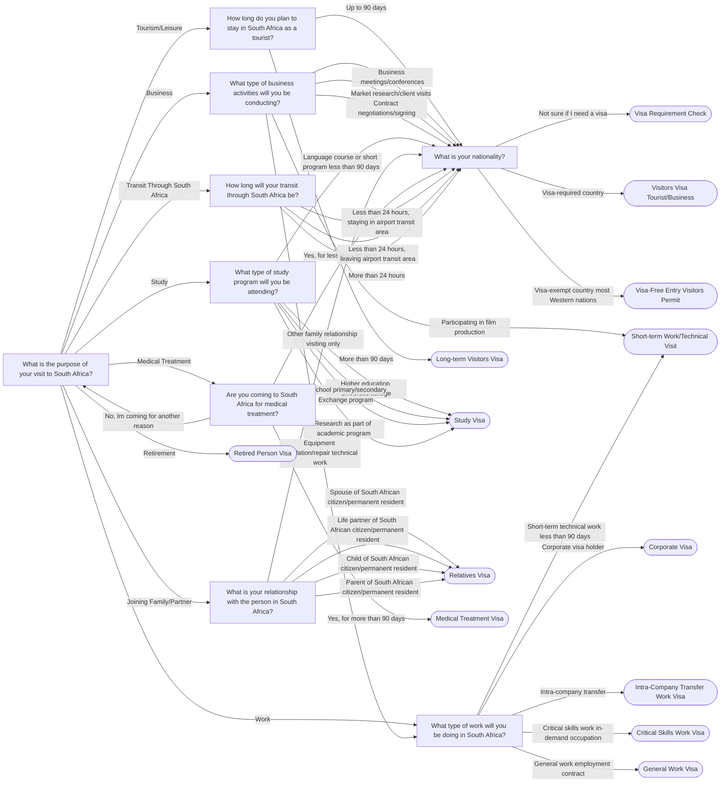

# Visa Decision Tree for southafrica

```mermaid
flowchart LR
    q1["What is the purpose of your visit to South Africa?"]
    q1 -->|Tourism/Leisure| q2
    q1 -->|Business| q3
    q1 -->|Work| q4
    q1 -->|Study| q5
    q1 -->|Joining Family/Partner| q6
    q1 -->|Medical Treatment| q7
    q1 -->|Retirement| r11
    q1 -->|Transit Through South Africa| q8
    q2["How long do you plan to stay in South Africa as a tourist?"]
    q2 -->|Up to 90 days| q9
    q2 -->|More than 90 days| r7
    q3["What type of business activities will you be conducting?"]
    q3 -->|Business meetings/conferences| q9
    q3 -->|Market research/client visits| q9
    q3 -->|Contract negotiations/signing| q9
    q3 -->|Equipment installation/repair technical work| q4
    q3 -->|Participating in film production| r6
    q4["What type of work will you be doing in South Africa?"]
    q4 -->|General work employment contract| r2
    q4 -->|Critical skills work in-demand occupation| r3
    q4 -->|Intra-company transfer| r4
    q4 -->|Corporate visa holder| r5
    q4 -->|Short-term technical work less than 90 days| r6
    q5["What type of study program will you be attending?"]
    q5 -->|Higher education university/college| r8
    q5 -->|School primary/secondary| r8
    q5 -->|Language course or short program less than 90 days| q9
    q5 -->|Exchange program| r8
    q5 -->|Research as part of academic program| r8
    q6["What is your relationship with the person in South Africa?"]
    q6 -->|Spouse of South African citizen/permanent resident| r9
    q6 -->|Life partner of South African citizen/permanent resident| r9
    q6 -->|Child of South African citizen/permanent resident| r9
    q6 -->|Parent of South African citizen/permanent resident| r9
    q6 -->|Other family relationship visiting only| q9
    q7["Are you coming to South Africa for medical treatment?"]
    q7 -->|Yes, for less than 90 days| q9
    q7 -->|Yes, for more than 90 days| r10
    q7 -->|No, Im coming for another reason| q1
    q8["How long will your transit through South Africa be?"]
    q8 -->|Less than 24 hours, staying in airport transit area| q9
    q8 -->|Less than 24 hours, leaving airport transit area| q9
    q8 -->|More than 24 hours| q9
    q9["What is your nationality?"]
    q9 -->|Visa-exempt country most Western nations| r1
    q9 -->|Visa-required country| r12
    q9 -->|Not sure if I need a visa| r13
    r1(["Visa-Free Entry Visitors Permit"])
    r2(["General Work Visa"])
    r3(["Critical Skills Work Visa"])
    r4(["Intra-Company Transfer Work Visa"])
    r5(["Corporate Visa"])
    r6(["Short-term Work/Technical Visit"])
    r7(["Long-term Visitors Visa"])
    r8(["Study Visa"])
    r9(["Relatives Visa"])
    r10(["Medical Treatment Visa"])
    r11(["Retired Person Visa"])
    r12(["Visitors Visa Tourist/Business"])
    r13(["Visa Requirement Check"])
```
