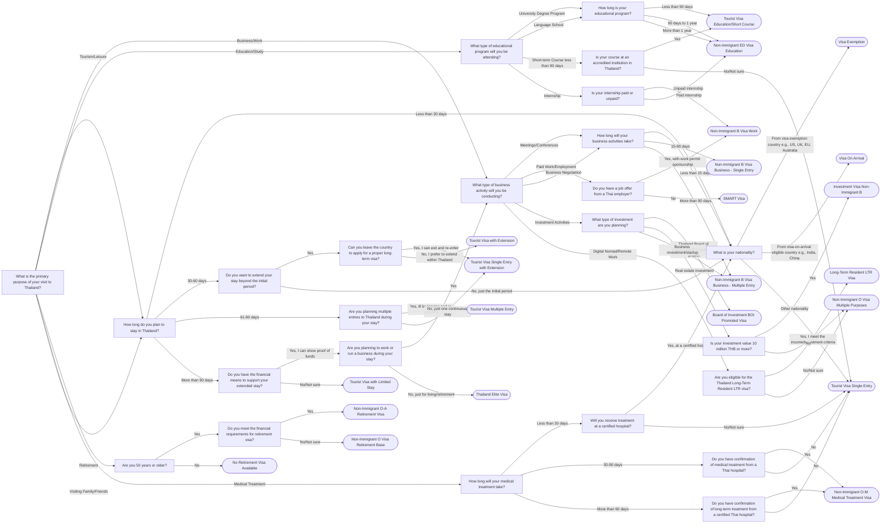

# Visa Decision Tree for thai

```mermaid
flowchart LR
    q1["What is the primary purpose of your visit to Thailand?"]
    q1 -->|Tourism/Leisure| q2
    q1 -->|Business/Work| q3
    q1 -->|Education/Study| q4
    q1 -->|Retirement| q5
    q1 -->|Medical Treatment| q6
    q1 -->|Visiting Family/Friends| q2
    q2["How long do you plan to stay in Thailand?"]
    q2 -->|Less than 30 days| q7
    q2 -->|30-60 days| q8
    q2 -->|61-90 days| q9
    q2 -->|More than 90 days| q10
    q3["What type of business activity will you be conducting?"]
    q3 -->|Meetings/Conferences| q11
    q3 -->|Paid Work/Employment| q12
    q3 -->|Business Negotiation| q11
    q3 -->|Investment Activities| q13
    q3 -->|Digital Nomad/Remote Work| q14
    q4["What type of educational program will you be attending?"]
    q4 -->|University Degree Program| q15
    q4 -->|Language School| q15
    q4 -->|Short-term Course less than 90 days| q16
    q4 -->|Internship| q17
    q5["Are you 50 years or older?"]
    q5 -->|Yes| q18
    q5 -->|No| r19
    q6["How long will your medical treatment take?"]
    q6 -->|Less than 30 days| q20
    q6 -->|30-90 days| q21
    q6 -->|More than 90 days| q22
    q7["What is your nationality?"]
    q7 -->|From visa exemption country e.g., US, UK, EU, Australia| r1
    q7 -->|From visa-on-arrival eligible country e.g., India, China| r2
    q7 -->|Other nationality| r3
    q8["Do you want to extend your stay beyond the initial period?"]
    q8 -->|Yes| q23
    q8 -->|No, just the initial period| q7
    q9["Are you planning multiple entries to Thailand during your stay?"]
    q9 -->|Yes, Ill be leaving and re-entering| r4
    q9 -->|No, just one continuous stay| r5
    q10["Do you have the financial means to support your extended stay?"]
    q10 -->|Yes, I can show proof of funds| q24
    q10 -->|No/Not sure| r6
    q11["How long will your business activities take?"]
    q11 -->|Less than 15 days| q7
    q11 -->|15-90 days| r7
    q11 -->|More than 90 days| r8
    q12["Do you have a job offer from a Thai employer?"]
    q12 -->|Yes, with work permit sponsorship| r9
    q12 -->|No| r10
    q13["What type of investment are you planning?"]
    q13 -->|Thailand Board of Investment BOI approved project| r11
    q13 -->|Real estate investment| q25
    q13 -->|Business investment/startup| r8
    q14["Are you eligible for the Thailand Long-Term Resident LTR visa?"]
    q14 -->|Yes, I meet the income/investment criteria| r12
    q14 -->|No/Not sure| r13
    q15["How long is your educational program?"]
    q15 -->|Less than 90 days| r14
    q15 -->|90 days to 1 year| r15
    q15 -->|More than 1 year| r15
    q16["Is your course at an accredited institution in Thailand?"]
    q16 -->|Yes| r14
    q16 -->|No/Not sure| r3
    q17["Is your internship paid or unpaid?"]
    q17 -->|Paid internship| r9
    q17 -->|Unpaid internship| r15
    q18["Do you meet the financial requirements for retirement visa?"]
    q18 -->|Yes| r16
    q18 -->|No/Not sure| r17
    q20["Will you receive treatment at a certified hospital?"]
    q20 -->|Yes, at a certified hospital| q7
    q20 -->|No/Not sure| r3
    q21["Do you have confirmation of medical treatment from a Thai hospital?"]
    q21 -->|Yes| r18
    q21 -->|No| r3
    q22["Do you have confirmation of long-term treatment from a certified Thai hospital?"]
    q22 -->|Yes| r18
    q22 -->|No| r3
    q23["Can you leave the country to apply for a proper long-term visa?"]
    q23 -->|Yes, I can exit and re-enter| r5
    q23 -->|No, I prefer to extend within Thailand| r20
    q24["Are you planning to work or run a business during your stay?"]
    q24 -->|Yes| q3
    q24 -->|No, just for living/retirement| r21
    q25["Is your investment value 10 million THB or more?"]
    q25 -->|Yes| r22
    q25 -->|No| r13
    r1(["Visa Exemption"])
    r2(["Visa On Arrival"])
    r3(["Tourist Visa Single Entry"])
    r4(["Tourist Visa Multiple Entry"])
    r5(["Tourist Visa Single Entry with Extension"])
    r6(["Tourist Visa with Limited Stay"])
    r7(["Non-Immigrant B Visa Business - Single Entry"])
    r8(["Non-Immigrant B Visa Business - Multiple Entry"])
    r9(["Non-Immigrant B Visa Work"])
    r10(["SMART Visa"])
    r11(["Board of Investment BOI Promoted Visa"])
    r12(["Long-Term Resident LTR Visa"])
    r13(["Non-Immigrant O Visa Multiple Purposes"])
    r14(["Tourist Visa Education/Short Course"])
    r15(["Non-Immigrant ED Visa Education"])
    r16(["Non-Immigrant O-A Retirement Visa"])
    r17(["Non-Immigrant O Visa Retirement Base"])
    r18(["Non-Immigrant O-M Medical Treatment Visa"])
    r19(["No Retirement Visa Available"])
    r20(["Tourist Visa with Extension"])
    r21(["Thailand Elite Visa"])
    r22(["Investment Visa Non-Immigrant B"])
```
