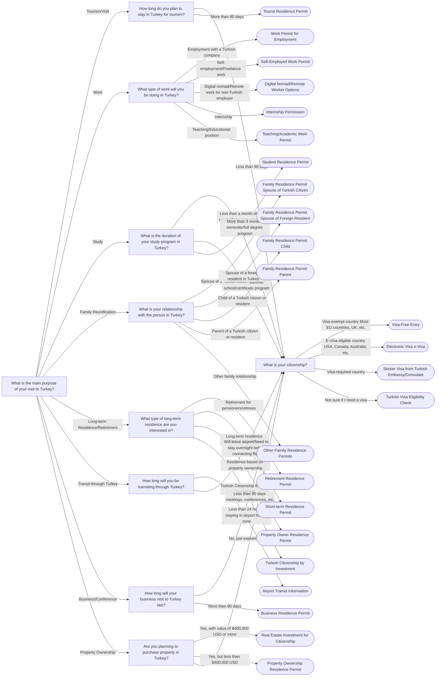

# Visa Decision Tree for Turkey (tr)

```mermaid
flowchart LR
    q1["What is the main purpose of your visit to Turkey?"]
    q1 -->|Tourism/Visit| q2
    q1 -->|Work| q3
    q1 -->|Study| q4
    q1 -->|Family Reunification| q5
    q1 -->|Long-term Residence/Retirement| q6
    q1 -->|Transit through Turkey| q7
    q1 -->|Business/Conference| q8
    q1 -->|Property Ownership| q9
    q2["How long do you plan to stay in Turkey for tourism?"]
    q2 -->|Less than 90 days| q10
    q2 -->|More than 90 days| r2
    q3["What type of work will you be doing in Turkey?"]
    q3 -->|Employment with a Turkish company| r3
    q3 -->|Self-employment/Freelance work| r4
    q3 -->|Digital nomad/Remote work for non-Turkish employer| r5
    q3 -->|Internship| r6
    q3 -->|Teaching/Educational position| r7
    q4["What is the duration of your study program in Turkey?"]
    q4 -->|Less than a month short course/language program| q10
    q4 -->|1-3 months summer school/certificate program| q10
    q4 -->|More than 3 months semester/full degree program| r8
    q5["What is your relationship with the person in Turkey?"]
    q5 -->|Spouse of a Turkish citizen| r9
    q5 -->|Spouse of a foreign resident in Turkey| r10
    q5 -->|Child of a Turkish citizen or resident| r11
    q5 -->|Parent of a Turkish citizen or resident| r12
    q5 -->|Other family relationship| r13
    q6["What type of long-term residence are you interested in?"]
    q6 -->|Retirement for pensioners/retirees| r14
    q6 -->|Long-term residence without working| r15
    q6 -->|Residence based on property ownership| r16
    q6 -->|Turkish Citizenship through investment| r17
    q7["How long will you be transiting through Turkey?"]
    q7 -->|Less than 24 hours, staying in airport transit zone| r18
    q7 -->|Will leave airport/Need to stay overnight before connecting flight| q10
    q8["How long will your business visit to Turkey last?"]
    q8 -->|Less than 90 days meetings, conferences, etc.| q10
    q8 -->|More than 90 days| r19
    q9["Are you planning to purchase property in Turkey?"]
    q9 -->|Yes, with value of $400,000 USD or more| r20
    q9 -->|Yes, but less than $400,000 USD| r21
    q9 -->|No, just exploring options| q10
    q10["What is your citizenship?"]
    q10 -->|Visa-exempt country Most EU countries, UK, etc.| r1
    q10 -->|E-Visa eligible country USA, Canada, Australia, etc.| r22
    q10 -->|Visa-required country| r23
    q10 -->|Not sure if I need a visa| r24
    r1(["Visa-Free Entry"])
    r2(["Tourist Residence Permit"])
    r3(["Work Permit for Employment"])
    r4(["Self-Employed Work Permit"])
    r5(["Digital Nomad/Remote Worker Options"])
    r6(["Internship Permission"])
    r7(["Teaching/Academic Work Permit"])
    r8(["Student Residence Permit"])
    r9(["Family Residence Permit Spouse of Turkish Citizen"])
    r10(["Family Residence Permit Spouse of Foreign Resident"])
    r11(["Family Residence Permit Child"])
    r12(["Family Residence Permit Parent"])
    r13(["Other Family Residence Permits"])
    r14(["Retirement Residence Permit"])
    r15(["Short-term Residence Permit"])
    r16(["Property Owner Residence Permit"])
    r17(["Turkish Citizenship by Investment"])
    r18(["Airport Transit Information"])
    r19(["Business Residence Permit"])
    r20(["Real Estate Investment for Citizenship"])
    r21(["Property Ownership Residence Permit"])
    r22(["Electronic Visa e-Visa"])
    r23(["Sticker Visa from Turkish Embassy/Consulate"])
    r24(["Turkish Visa Eligibility Check"])
```
