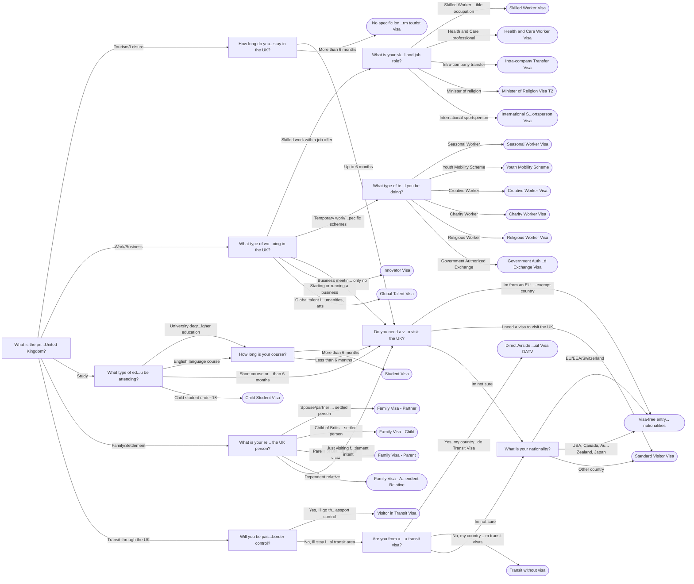

# Visa Decision Tree for uk

```mermaid
flowchart LR
    q1["What is the pri...United Kingdom?"]
    q1 -->|Tourism/Leisure| q2
    q1 -->|Work/Business| q3
    q1 -->|Study| q4
    q1 -->|Family/Settlement| q5
    q1 -->|Transit through the UK| q6
    q2["How long do you...stay in the UK?"]
    q2 -->|Up to 6 months| q7
    q2 -->|More than 6 months| r16
    q3["What type of wo...oing in the UK?"]
    q3 -->|Skilled work with a job offer| q8
    q3 -->|Temporary work/...pecific schemes| q9
    q3 -->|Business meetin... only no work| q7
    q3 -->|Starting or running a business| r5
    q3 -->|Global talent i...umanities, arts| r6
    q4["What type of ed...u be attending?"]
    q4 -->|University degr...igher education| q10
    q4 -->|English language course| q10
    q4 -->|Short course or... than 6 months| q7
    q4 -->|Child student under 18| r7
    q5["What is your re... the UK person?"]
    q5 -->|Spouse/partner ... settled person| r8
    q5 -->|Child of Britis... settled person| r9
    q5 -->|Parent of Briti...h citizen child| r10
    q5 -->|Dependent relative| r11
    q5 -->|Just visiting f...tlement intent| q7
    q6["Will you be pas...border control?"]
    q6 -->|Yes, Ill go th...assport control| r12
    q6 -->|No, Ill stay i...al transit area| q11
    q7["Do you need a v...o visit the UK?"]
    q7 -->|Im from an EU ...-exempt country| r1
    q7 -->|I need a visa to visit the UK| r2
    q7 -->|Im not sure| q12
    q8["What is your sk...l and job role?"]
    q8 -->|Skilled Worker ...ible occupation| r3
    q8 -->|Health and Care professional| r4
    q8 -->|Intra-company transfer| r13
    q8 -->|Minister of religion| r14
    q8 -->|International sportsperson| r15
    q9["What type of te...l you be doing?"]
    q9 -->|Seasonal Worker| r17
    q9 -->|Youth Mobility Scheme| r18
    q9 -->|Creative Worker| r19
    q9 -->|Charity Worker| r20
    q9 -->|Religious Worker| r21
    q9 -->|Government Authorized Exchange| r22
    q10["How long is your course?"]
    q10 -->|More than 6 months| r23
    q10 -->|Less than 6 months| q7
    q11["Are you from a ...a transit visa?"]
    q11 -->|Yes, my country...de Transit Visa| r24
    q11 -->|No, my country ...m transit visas| r25
    q11 -->|Im not sure| q12
    q12["What is your nationality?"]
    q12 -->|EU/EEA/Switzerland| r1
    q12 -->|USA, Canada, Au... Zealand, Japan| r1
    q12 -->|Other country| r2
    r1(["Visa-free entry... nationalities"])
    r2(["Standard Visitor Visa"])
    r3(["Skilled Worker Visa"])
    r4(["Health and Care Worker Visa"])
    r5(["Innovator Visa"])
    r6(["Global Talent Visa"])
    r7(["Child Student Visa"])
    r8(["Family Visa - Partner"])
    r9(["Family Visa - Child"])
    r10(["Family Visa - Parent"])
    r11(["Family Visa - A...endent Relative"])
    r12(["Visitor in Transit Visa"])
    r13(["Intra-company Transfer Visa"])
    r14(["Minister of Religion Visa T2"])
    r15(["International S...ortsperson Visa"])
    r16(["No specific lon...rm tourist visa"])
    r17(["Seasonal Worker Visa"])
    r18(["Youth Mobility Scheme"])
    r19(["Creative Worker Visa"])
    r20(["Charity Worker Visa"])
    r21(["Religious Worker Visa"])
    r22(["Government Auth...d Exchange Visa"])
    r23(["Student Visa"])
    r24(["Direct Airside ...sit Visa DATV"])
    r25(["Transit without visa"])
```
