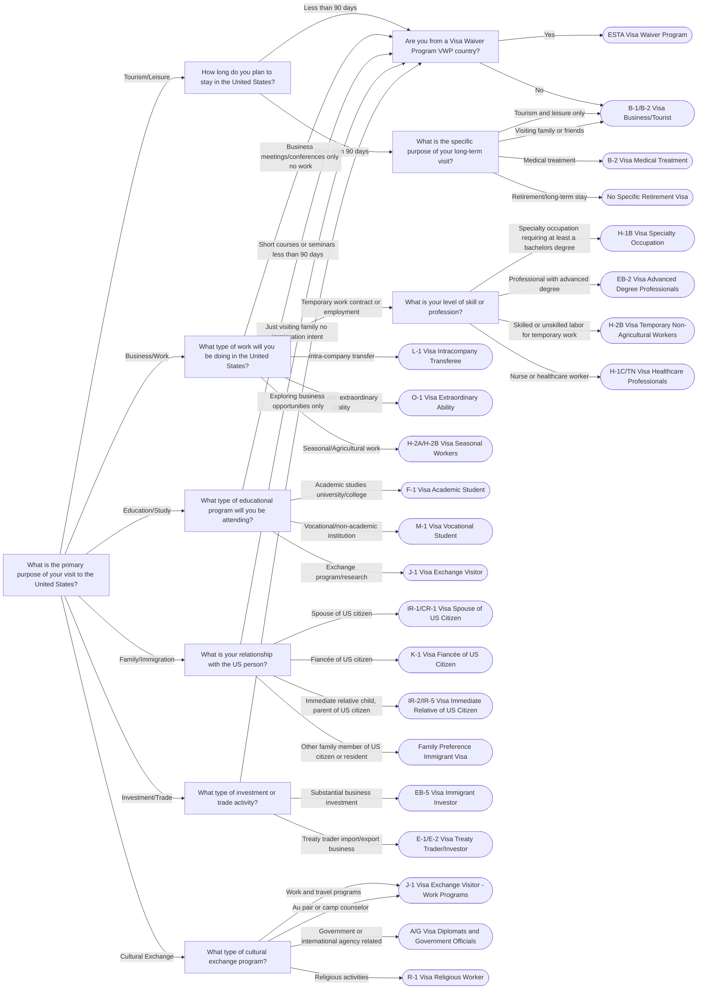

# Visa Decision Tree for United States (us)

```mermaid
flowchart LR
    q1["What is the primary purpose of your visit to the United States?"]
    q1 -->|Tourism/Leisure| q2
    q1 -->|Business/Work| q3
    q1 -->|Education/Study| q4
    q1 -->|Family/Immigration| q5
    q1 -->|Investment/Trade| q6
    q1 -->|Cultural Exchange| q7
    q2["How long do you plan to stay in the United States?"]
    q2 -->|Less than 90 days| q8
    q2 -->|More than 90 days| q9
    q3["What type of work will you be doing in the United States?"]
    q3 -->|Temporary work contract or employment| q10
    q3 -->|Intra-company transfer| r1
    q3 -->|Person with extraordinary ability| r2
    q3 -->|Seasonal/Agricultural work| r3
    q3 -->|Business meetings/conferences only no work| q8
    q4["What type of educational program will you be attending?"]
    q4 -->|Academic studies university/college| r4
    q4 -->|Vocational/non-academic institution| r5
    q4 -->|Exchange program/research| r6
    q4 -->|Short courses or seminars less than 90 days| q8
    q5["What is your relationship with the US person?"]
    q5 -->|Spouse of US citizen| r7
    q5 -->|Fiancée of US citizen| r8
    q5 -->|Immediate relative child, parent of US citizen| r9
    q5 -->|Other family member of US citizen or resident| r10
    q5 -->|Just visiting family no immigration intent| q8
    q6["What type of investment or trade activity?"]
    q6 -->|Substantial business investment| r11
    q6 -->|Treaty trader import/export business| r12
    q6 -->|Exploring business opportunities only| q8
    q7["What type of cultural exchange program?"]
    q7 -->|Work and travel programs| r13
    q7 -->|Au pair or camp counselor| r13
    q7 -->|Government or international agency related| r14
    q7 -->|Religious activities| r15
    q8["Are you from a Visa Waiver Program VWP country?"]
    q8 -->|Yes| r16
    q8 -->|No| r17
    q9["What is the specific purpose of your long-term visit?"]
    q9 -->|Tourism and leisure only| r17
    q9 -->|Visiting family or friends| r17
    q9 -->|Medical treatment| r18
    q9 -->|Retirement/long-term stay| r19
    q10["What is your level of skill or profession?"]
    q10 -->|Specialty occupation requiring at least a bachelors degree| r20
    q10 -->|Professional with advanced degree| r21
    q10 -->|Skilled or unskilled labor for temporary work| r22
    q10 -->|Nurse or healthcare worker| r23
    r1(["L-1 Visa Intracompany Transferee"])
    r2(["O-1 Visa Extraordinary Ability"])
    r3(["H-2A/H-2B Visa Seasonal Workers"])
    r4(["F-1 Visa Academic Student"])
    r5(["M-1 Visa Vocational Student"])
    r6(["J-1 Visa Exchange Visitor"])
    r7(["IR-1/CR-1 Visa Spouse of US Citizen"])
    r8(["K-1 Visa Fiancée of US Citizen"])
    r9(["IR-2/IR-5 Visa Immediate Relative of US Citizen"])
    r10(["Family Preference Immigrant Visa"])
    r11(["EB-5 Visa Immigrant Investor"])
    r12(["E-1/E-2 Visa Treaty Trader/Investor"])
    r13(["J-1 Visa Exchange Visitor - Work Programs"])
    r14(["A/G Visa Diplomats and Government Officials"])
    r15(["R-1 Visa Religious Worker"])
    r16(["ESTA Visa Waiver Program"])
    r17(["B-1/B-2 Visa Business/Tourist"])
    r18(["B-2 Visa Medical Treatment"])
    r19(["No Specific Retirement Visa"])
    r20(["H-1B Visa Specialty Occupation"])
    r21(["EB-2 Visa Advanced Degree Professionals"])
    r22(["H-2B Visa Temporary Non-Agricultural Workers"])
    r23(["H-1C/TN Visa Healthcare Professionals"])
```
